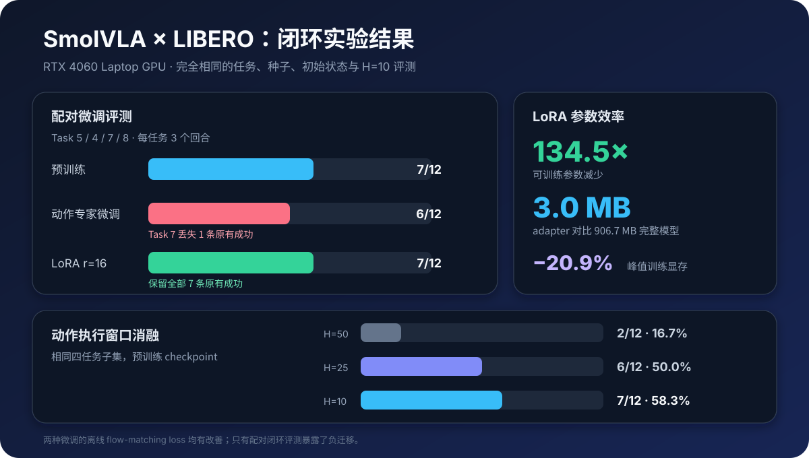
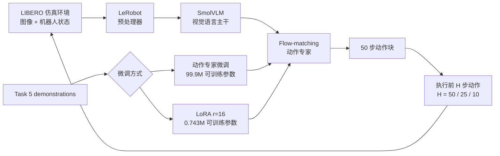
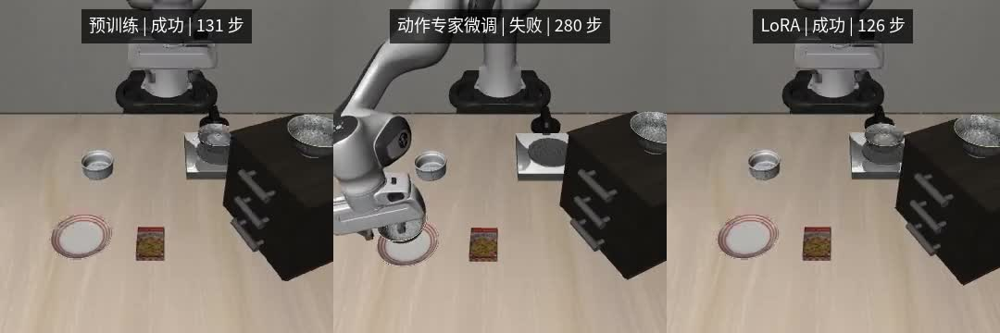

# SmolVLA × LIBERO：仿真闭环复现、消融与参数高效微调

本项目完整复现了 SmolVLA 在 LIBERO 中从仿真环境重置、GPU 推理到多任务闭环评测的整条链路，
并进一步完成动作执行窗口消融、动作专家微调和 LoRA 参数高效微调。全部实验均在一张 NVIDIA
GeForce RTX 4060 Laptop GPU（8 GB）上完成，没有使用真机或租用云端 GPU。

核心发现是：动作专家微调和 LoRA 都让留出集的 flow-matching loss 下降约 2.5%，但都没有改善
目标 Task 5 的 0/3 闭环结果。严格配对评测进一步发现，动作专家微调丢失了一条原本成功的轨迹，
而 LoRA 用少 99.26% 的可训练参数保住了预训练策略的全部 7 条成功轨迹。



## 项目亮点

- 跑通 MuJoCo/EGL 无头仿真、观测预处理、SmolVLA 动作生成和 receding-horizon 闭环控制。
- 覆盖全部 10 个 LIBERO Spatial 任务，共评测 30 个回合，得到 **18/30（60.0%）** 本地复现结果。
- 在固定四任务困难子集上完成动作执行窗口消融：**H=50 为 2/12**、**H=25 为 6/12**、
  **H=10 为 7/12**。
- 为 Task 5 构建确定性的 31/8 demonstration 训练/验证划分，以及任务、初始状态、随机种子、
  预处理和执行窗口完全一致的配对回归测试。
- 对比 99.9M 参数的动作专家微调和 rank-16 LoRA：LoRA 仅训练 0.743M 参数，adapter 为 3.0 MB，
  峰值训练显存降低 20.9%，并避免了动作专家微调出现的闭环退化。
- 对 checkpoint 重载、动作有限值、轨迹归档、视频哈希和视频可解码性进行完整审计。

## World Model 扩展进度

当前已完成 WM 阶段 0—3：冻结 `v0.1.0` 闭环基线，审计 432 个 LIBERO Spatial 专家
episode，生成按任务分层、episode 级互斥的 346/43/43 训练/验证/测试划分，并跑通冻结
DINOv2-S/14 双相机表征 pilot 及全量缓存。最终以 episode 级原子分片处理 389 个
train/validation episode、47,822 帧和 95,644 张图像，完整缓存约 1.10 GiB；389/389 shard
通过 resume、哈希、模态对齐和确定性重算验证，43 个 test episode 零进入。现有 78 个闭环
rollout 因没有同步保存双相机观测和 proprioception，仅作为回采索引，不会被误用为 WM-v1
训练数据。详见
[数据审计](docs/WM_STAGE11_DATA_AUDIT.md)与
[冻结视觉表征 Pilot](docs/WM_STAGE12_REPRESENTATION_PILOT.md)、
[全量连续特征缓存](docs/WM_STAGE13_FULL_FEATURE_CACHE.md)。

## 系统闭环



仿真闭环沿用 LeRobot 官方策略和环境处理路径。策略每次预测 50 步动作块，`n_action_steps` 决定
下一次获取观测并重新推理前实际执行多少步动作。

## 核心结果

### 十任务预训练基线

固定 `lerobot/smolvla_libero` checkpoint，在 10 个 LIBERO Spatial 任务上各测试 3 个确定性初始
状态，共得到 18/30 次成功。该结果是本地小样本复现测量，不等同于论文完整官方评测结果。

### 动作执行窗口消融

| 执行窗口 | 成功数 | 成功率 | 解释 |
| ---: | ---: | ---: | --- |
| 50 | 2/12 | 16.7% | 推理频率最低，视觉反馈最弱 |
| 25 | 6/12 | 50.0% | 可以更及时地修正累积误差 |
| 10 | 7/12 | 58.3% | 本次实验中成功率最高 |

三组实验使用完全相同的任务、初始状态和随机种子。结果说明，只验证 VLA 单次推理是否正确还不够，
动作重规划频率会直接改变最终闭环行为。

### 动作专家微调与 LoRA

两种方法均从同一 checkpoint 出发，使用相同的 Task 5 数据划分、随机种子、batch size、1000 个
训练 step、BF16 精度和学习率调度。

| 指标 | 动作专家微调 | LoRA r=16 |
| --- | ---: | ---: |
| 可训练参数 | 99,880,992（22.19%） | 742,656（0.165%） |
| 留出集 loss | 0.066339 → 0.064797 | 0.066339 → 0.064686 |
| 峰值训练显存 | 2.195 GB | 1.737 GB |
| 训练时间 | 324.39 秒 | 279.24 秒 |
| 可部署产物 | 906.71 MB 完整模型 | 3.00 MB adapter |
| H=10 配对成功数 | 6/12 | 7/12 |
| 丢失原有成功 | 1 | 0 |

各任务的严格配对结果：

| 策略 | Task 5（训练目标） | Task 4 | Task 7 | Task 8 | 总计 |
| --- | ---: | ---: | ---: | ---: | ---: |
| 预训练 | 0/3 | 2/3 | 3/3 | 2/3 | 7/12 |
| 动作专家微调 | 0/3 | 2/3 | 2/3 | 2/3 | 6/12 |
| LoRA | 0/3 | 2/3 | 3/3 | 2/3 | 7/12 |

这是一个目标任务没有提升的负结果，而不是基础设施失败。它给出了一个具体反例：仅根据离线
imitation loss 选择 checkpoint 可能产生误判，而限制单任务更新容量可以减少对已有能力的干扰。

## 严格配对的视频案例

[](media/task7_paired_comparison.mp4)

Task 7、初始状态 2、H=10。预训练策略在 131 步成功；动作专家微调运行到 280 步上限仍未完成
稳定放置；LoRA 在 126 步成功。为保持三段视频同屏对齐，较短的成功视频会在最后一帧停留。
点击图片即可打开 MP4。

## 环境

每份 JSON 报告都保存了实际软件版本。最终实验使用 Python 3.12、LeRobot 0.5.2、PyTorch 2.11.0
+ CUDA 12.8、Transformers 5.5.4、PEFT 0.19.1、MuJoCo 3.8.1 和 robosuite 1.4.0。

环境由 `uv` 管理，依赖中的 LeRobot 固定到本次实验使用的提交。首次安装需要 Linux、Git、
FFmpeg 和可用的 NVIDIA 驱动：

```bash
uv sync --python 3.12 --locked
uv run --no-sync python -c "import torch; print(torch.cuda.is_available())"
```

建议使用支持 BF16 的 NVIDIA GPU；无头仿真设置 `MUJOCO_GL=egl`。checkpoint、视觉语言 backbone、
数据集缓存、训练权重和原始评测输出保存在 `outputs/` 或 Hugging Face 缓存中，不提交到 Git。

## 复现方法

以下命令均从本仓库根目录执行。阶段 2 和阶段 3 准备固定版本的模型文件；checkpoint、
backbone、数据集和 LIBERO assets 缓存完成后，后续阶段可以离线运行。

### 1. 仿真与模型推理链路

```bash
MUJOCO_GL=egl uv run --no-sync python \
  scripts/stage1_sim_smoke.py

uv run --no-sync python \
  scripts/stage2_prepare_checkpoint.py

HF_HUB_DOWNLOAD_TIMEOUT=300 MUJOCO_GL=egl uv run --no-sync python \
  scripts/stage3_single_inference.py

HF_HUB_OFFLINE=1 TRANSFORMERS_OFFLINE=1 MUJOCO_GL=egl uv run --no-sync python \
  scripts/stage4_closed_loop_episode.py
```

### 2. 十任务基线与执行窗口消融

```bash
HF_HUB_OFFLINE=1 TRANSFORMERS_OFFLINE=1 MUJOCO_GL=egl uv run --no-sync python \
  scripts/stage5_small_benchmark.py \
  --output-dir outputs/stage6_full_spatial_benchmark \
  --task-ids 0 1 2 3 4 5 6 7 8 9

HF_HUB_OFFLINE=1 TRANSFORMERS_OFFLINE=1 MUJOCO_GL=egl uv run --no-sync python \
  scripts/stage7_action_horizon_ablation.py
```

### 3. 受控微调对比

```bash
HF_HUB_OFFLINE=1 TRANSFORMERS_OFFLINE=1 uv run --no-sync python \
  scripts/stage9_task5_finetune.py

HF_HUB_OFFLINE=1 TRANSFORMERS_OFFLINE=1 uv run --no-sync python \
  scripts/stage10_task5_lora.py
```

闭环评测时直接加载未合并的 LoRA adapter，避免在 BF16 执行前合并低秩增量造成数值变化：

```bash
HF_HUB_OFFLINE=1 TRANSFORMERS_OFFLINE=1 MUJOCO_GL=egl uv run --no-sync python \
  scripts/stage5_small_benchmark.py \
  --checkpoint-dir outputs/stage2_checkpoint/checkpoint \
  --adapter-dir outputs/stage10_task5_lora/checkpoint_final/adapter \
  --output-dir outputs/stage10_task5_lora_eval \
  --task-ids 5 4 7 8 \
  --episodes-per-task 3 \
  --n-action-steps 10 \
  --fine-tune-report outputs/stage10_task5_lora/report.json \
  --comparison-report outputs/stage7_action_horizon_ablation/report.json
```

Stage 10 脚本会在训练前核对 Stage 9 的所有控制变量，只保存 LoRA adapter 和 optimizer，并要求
adapter 重载前后的参数哈希及固定验证 loss 完全一致。

## 项目结构

```text
.
├── scripts/                         # 阶段 1—10 复现脚本与 WM 扩展脚本
├── docs/                            # 各阶段实验设置、结果和边界
├── results/                         # 指标摘要、逐回合 CSV 与验证曲线
├── media/                           # 轻量结果图与严格配对视频
├── pyproject.toml                   # 固定上游版本的 uv 环境
└── uv.lock                          # 完整依赖锁文件
```

详细结果：

- [十任务基线](docs/STAGE6_RESULTS.md)
- [动作执行窗口消融](docs/STAGE7_RESULTS.md)
- [训练链路检查](docs/STAGE8_RESULTS.md)
- [动作专家微调](docs/STAGE9_RESULTS.md)
- [LoRA 对照](docs/STAGE10_RESULTS.md)
- [WM 阶段 0—1：数据审计与确定性划分](docs/WM_STAGE11_DATA_AUDIT.md)
- [WM 阶段 2：冻结视觉表征 Pilot](docs/WM_STAGE12_REPRESENTATION_PILOT.md)
- [WM 阶段 3：全量连续特征缓存](docs/WM_STAGE13_FULL_FEATURE_CACHE.md)
- [结果与媒体来源说明](media/README.md)
- [第三方项目、模型和数据说明](THIRD_PARTY_NOTICES.md)

其中 `results/episodes/` 公开了 30 回合基线、三组执行窗口以及两种微调策略的逐回合结果；
`results/training/` 公开了两种微调方法在同一留出集上的验证曲线。CSV 中的本机绝对路径已改为
仓库内相对产物路径，原始 checkpoint、轨迹和批量视频仍由 `.gitignore` 排除。

## 结论边界

- 十任务基线每个任务只有 3 个初始状态，置信区间仍然很宽，不能替代完整官方评测协议。
- 公开 checkpoint 已经在公开 LIBERO 数据集上训练；本项目的单任务 behavior cloning 主要是在已有
  分布上继续拟合，并没有引入全新的行为数据。
- 两种微调方式都没有解决 Task 5。结论仅限于工程复现、参数效率以及本次配对实验中观察到的遗忘
  差异，不能宣称 LoRA 普遍优于完整微调。
- 当前只有仿真闭环，没有覆盖真机感知、标定、控制延迟和安全问题。

这些限制被明确保留，因为它们决定了实验结果能够支持哪些结论。
