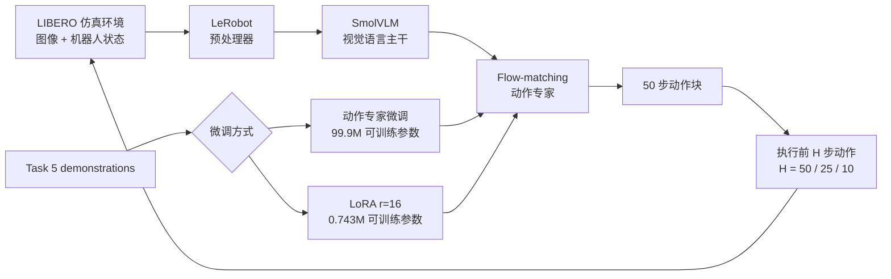

# SmolVLA × LIBERO：统计可信闭环评测、消融与参数高效微调

本项目完整复现了 SmolVLA 在 LIBERO 中从仿真环境重置、GPU 推理到多任务闭环评测的整条链路，
并进一步完成 260 个唯一正式 episode 的统计扩展、动作执行窗口消融、动作专家微调和 LoRA
参数高效微调。全部实验均在一张 NVIDIA GeForce RTX 4060 Laptop GPU（8 GB）上完成，没有
使用真机或租用云端 GPU。

扩大后的核心发现是：在 Task 4/5/7/8 的 40 个严格配对状态上，H=50、25、10 分别取得
12/40、20/40、23/40；H=25 与 H=10 相对 H=50 的改善通过 Holm 校正的精确 McNemar 检验。
与此同时，全量动作专家和 LoRA 虽让离线验证 loss 分别下降 2.32% 和 2.49%，闭环结果仍只有
22/40 和 23/40，对照预训练为 23/40。该证据支持“离线 loss 改善不保证闭环提升”，但不支持
“H=10 显著优于 H=25”。


## 项目亮点

- 跑通 MuJoCo/EGL 无头仿真、观测预处理、SmolVLA 动作生成和 receding-horizon 闭环控制。
- 冻结协议后统一审计 **260 个唯一正式 episode**：10 任务基线 **58/100（58.0%，Wilson
  95% CI [48.2%, 67.2%]）**。
- 在 40 个相同任务-状态-seed 上完成 H=50/25/10 严格配对；H=25 和 H=10 相对 H=50 的
  Holm 校正 `p=0.0156/0.0103`，H=10 与 H=25 则不显著（`p=0.453`）。
- 为 Task 5 构建确定性的 31/8 demonstration 训练/验证划分，以及任务、初始状态、随机种子、
  预处理和执行窗口完全一致的配对回归测试。
- 对比 99.9M 参数的动作专家微调和 rank-16 LoRA：LoRA 仅训练 0.743M 参数，在 40 个配对状态
  上保持预训练全部 23 条成功标签，但没有新增成功。
- 完成 **114/114** 失败视频分类，以及 20 个状态 × 3 个策略 seed 的随机性审计；对 checkpoint
  重载、动作有限值、轨迹归档、视频哈希和可解码性进行完整审计。

## 统计扩展结果

冻结协议、完整统计、失败分布、成本、复现命令和结论边界见
[《SmolVLA × LIBERO 统计可信闭环评测》](docs/STATISTICAL_EVALUATION.md)。

### 10 任务基线

固定预训练 checkpoint 和 H=50，每任务官方 init 0–9：

| 指标 | 结果 |
| --- | ---: |
| 总成功率 | **58/100（58.0%）** |
| Wilson 95% CI | **[48.2%, 67.2%]** |
| 成功步数 mean / p50 / p95 | 104.93 / 107 / 129.15 |
| 失败右删失 | 42/42 均达到 280 步 |
| 新增回合单 forward mean / p50 / p95 | 0.538 / 0.534 / 0.630 s |
| 新增回合峰值推理显存 | 约 0.905 GiB |

### Action Horizon：40 状态严格配对

| H | 成功数 | Wilson 95% CI | 相对 H=50 的 Holm p |
| ---: | ---: | ---: | ---: |
| 50 | 12/40（30.0%） | [18.1%, 45.4%] | — |
| 25 | 20/40（50.0%） | [35.2%, 64.8%] | **0.015625** |
| 10 | 23/40（57.5%） | [42.2%, 71.5%] | **0.010254** |

H=25 与 H=10 的直接比较为 `p=0.453125`，不能写成显著差异。

[](media/statistical_horizon_task8_init9.mp4)

Task 8、init 9、环境 seed 1009、策略 seed 1009：H=50/H=25 均在 280 步失败，H=10 在
89 步成功。源视频、配置和 SHA-256 见
[媒体 manifest](results/statistical_evaluation/media_manifest.json)。

### 模型适配：40 状态严格配对

| 策略 | 离线验证 loss 变化 | 闭环成功 | 配对结论 |
| --- | ---: | ---: | --- |
| 预训练 | — | **23/40** | 对照 |
| 全量动作专家 | −2.32% | **22/40** | 丢失 1、增加 0，`p=1.0` |
| LoRA r=16 | −2.49% | **23/40** | 与预训练标签 40/40 一致，`p=1.0` |

Task 5 在三种策略下都为 0/10。LoRA 的价值在本实验中是以少 99.26% 的可训练参数保持成功标签，
而不是提高闭环成功率。

### 失败与随机性

114 个正式失败中，放置后未稳定满足成功占 48（42.1%）、抓取失败 38（33.3%）、抓取后掉落
22（19.3%）。所有语义标签均由冻结 taxonomy 和 12 帧 contact sheet 复核：


固定环境状态、只改变策略 seed 时，20/20 个状态的动作发生变化，3/20 的成功标签变化。因此
主实验是预注册单 seed 的严格配对结果，不宣称跨 seed 平均效果。

公开轻量结果位于 [`results/statistical_evaluation/`](results/statistical_evaluation/)；原始
checkpoint、视频、轨迹和完整 contact sheet 保存在 `outputs/` 且不提交 Git。

## 系统闭环



仿真闭环沿用 LeRobot 官方策略和环境处理路径。策略每次预测 50 步动作块，`n_action_steps` 决定
下一次获取观测并重新推理前实际执行多少步动作。

## 早期 3 状态结果（历史）

以下是统计扩展前的 3-state 初始结果，保留用于复现历史和说明实验演进；当前主结论以上方
40/100-state 扩展为准。

### 十任务预训练基线

固定 `lerobot/smolvla_libero` checkpoint，在 10 个 LIBERO Spatial 任务上各测试 3 个确定性初始
状态，共得到 18/30 次成功。该结果是本地小样本复现测量，不等同于论文完整官方评测结果。

### 动作执行窗口消融

| 执行窗口 | 成功数 | 成功率 | 解释 |
| ---: | ---: | ---: | --- |
| 50 | 2/12 | 16.7% | 推理频率最低，视觉反馈最弱 |
| 25 | 6/12 | 50.0% | 可以更及时地修正累积误差 |
| 10 | 7/12 | 58.3% | 本次实验中成功率最高 |

三组实验使用完全相同的任务、初始状态和随机种子。结果说明，只验证 VLA 单次推理是否正确还不够，
动作重规划频率会直接改变最终闭环行为。

### 动作专家微调与 LoRA

两种方法均从同一 checkpoint 出发，使用相同的 Task 5 数据划分、随机种子、batch size、1000 个
训练 step、BF16 精度和学习率调度。

| 指标 | 动作专家微调 | LoRA r=16 |
| --- | ---: | ---: |
| 可训练参数 | 99,880,992（22.19%） | 742,656（0.165%） |
| 留出集 loss | 0.066339 → 0.064797 | 0.066339 → 0.064686 |
| 峰值训练显存 | 2.195 GB | 1.737 GB |
| 训练时间 | 324.39 秒 | 279.24 秒 |
| 可部署产物 | 906.71 MB 完整模型 | 3.00 MB adapter |
| H=10 配对成功数 | 6/12 | 7/12 |
| 丢失原有成功 | 1 | 0 |

各任务的严格配对结果：

| 策略 | Task 5（训练目标） | Task 4 | Task 7 | Task 8 | 总计 |
| --- | ---: | ---: | ---: | ---: | ---: |
| 预训练 | 0/3 | 2/3 | 3/3 | 2/3 | 7/12 |
| 动作专家微调 | 0/3 | 2/3 | 2/3 | 2/3 | 6/12 |
| LoRA | 0/3 | 2/3 | 3/3 | 2/3 | 7/12 |

这是一个目标任务没有提升的负结果，而不是基础设施失败。它给出了一个具体反例：仅根据离线
imitation loss 选择 checkpoint 可能产生误判，而限制单任务更新容量可以减少对已有能力的干扰。

## 严格配对的视频案例

[](media/task7_paired_comparison.mp4)

Task 7、初始状态 2、H=10。预训练策略在 131 步成功；动作专家微调运行到 280 步上限仍未完成
稳定放置；LoRA 在 126 步成功。为保持三段视频同屏对齐，较短的成功视频会在最后一帧停留。
点击图片即可打开 MP4。

## 环境

每份 JSON 报告都保存了实际软件版本。最终实验使用 Python 3.12、LeRobot 0.5.2、PyTorch 2.11.0
+ CUDA 12.8、Transformers 5.5.4、PEFT 0.19.1、MuJoCo 3.8.1 和 robosuite 1.4.0。

环境由 `uv` 管理，依赖中的 LeRobot 固定到本次实验使用的提交。首次安装需要 Linux、Git、
FFmpeg 和可用的 NVIDIA 驱动：

```bash
uv sync --python 3.12 --locked
uv run --no-sync python -c "import torch; print(torch.cuda.is_available())"
```

建议使用支持 BF16 的 NVIDIA GPU；无头仿真设置 `MUJOCO_GL=egl`。checkpoint、视觉语言 backbone、
数据集缓存、训练权重和原始评测输出保存在 `outputs/` 或 Hugging Face 缓存中，不提交到 Git。

## 复现方法

以下命令均从本仓库根目录执行。阶段 2 和阶段 3 准备固定版本的模型文件；checkpoint、
backbone、数据集和 LIBERO assets 缓存完成后，后续阶段可以离线运行。

### 1. 仿真与模型推理链路

```bash
MUJOCO_GL=egl uv run --no-sync python \
  scripts/stage1_sim_smoke.py

uv run --no-sync python \
  scripts/stage2_prepare_checkpoint.py

HF_HUB_DOWNLOAD_TIMEOUT=300 MUJOCO_GL=egl uv run --no-sync python \
  scripts/stage3_single_inference.py

HF_HUB_OFFLINE=1 TRANSFORMERS_OFFLINE=1 MUJOCO_GL=egl uv run --no-sync python \
  scripts/stage4_closed_loop_episode.py
```

### 2. 十任务基线与执行窗口消融

```bash
HF_HUB_OFFLINE=1 TRANSFORMERS_OFFLINE=1 MUJOCO_GL=egl uv run --no-sync python \
  scripts/stage5_small_benchmark.py \
  --output-dir outputs/stage6_full_spatial_benchmark \
  --task-ids 0 1 2 3 4 5 6 7 8 9

HF_HUB_OFFLINE=1 TRANSFORMERS_OFFLINE=1 MUJOCO_GL=egl uv run --no-sync python \
  scripts/stage7_action_horizon_ablation.py
```

### 3. 受控微调对比

```bash
HF_HUB_OFFLINE=1 TRANSFORMERS_OFFLINE=1 uv run --no-sync python \
  scripts/stage9_task5_finetune.py

HF_HUB_OFFLINE=1 TRANSFORMERS_OFFLINE=1 uv run --no-sync python \
  scripts/stage10_task5_lora.py
```

闭环评测时直接加载未合并的 LoRA adapter，避免在 BF16 执行前合并低秩增量造成数值变化：

```bash
HF_HUB_OFFLINE=1 TRANSFORMERS_OFFLINE=1 MUJOCO_GL=egl uv run --no-sync python \
  scripts/stage5_small_benchmark.py \
  --checkpoint-dir outputs/stage2_checkpoint/checkpoint \
  --adapter-dir outputs/stage10_task5_lora/checkpoint_final/adapter \
  --output-dir outputs/stage10_task5_lora_eval \
  --task-ids 5 4 7 8 \
  --episodes-per-task 3 \
  --n-action-steps 10 \
  --fine-tune-report outputs/stage10_task5_lora/report.json \
  --comparison-report outputs/stage7_action_horizon_ablation/report.json
```

Stage 10 脚本会在训练前核对 Stage 9 的所有控制变量，只保存 LoRA adapter 和 optimizer，并要求
adapter 重载前后的参数哈希及固定验证 loss 完全一致。

### 4. 统计扩展、随机性与失败分类

```bash
PYTHON=/home/jump/projects/lerobot/.venv/bin/python

HF_HUB_OFFLINE=1 TRANSFORMERS_OFFLINE=1 MUJOCO_GL=egl \
  $PYTHON scripts/stage29_statistical_evaluation.py --mode formal

HF_HUB_OFFLINE=1 TRANSFORMERS_OFFLINE=1 MUJOCO_GL=egl \
  $PYTHON scripts/stage29_statistical_evaluation.py --mode randomness

$PYTHON scripts/stage30_analyze_statistical_evaluation.py
$PYTHON scripts/stage31_prepare_failure_review.py --review-page-size 4 --apply-labels

# PNG 栅格化需要一个本地 CJK 字体；SVG 本身保留字体 fallback
$PYTHON scripts/stage32_build_statistical_public_artifacts.py \
  --cjk-font /path/to/NotoSansCJKsc-Regular.otf
```

Stage 29 按 episode 原子保存记录并校验 resume；重复执行不会重跑已通过协议、视频、轨迹和哈希
验证的条目。完整命令和文件索引见
[统计评测报告](docs/STATISTICAL_EVALUATION.md)。

## 项目结构

```text
.
├── protocols/                       # 新结果前冻结的统计协议与 failure taxonomy
├── annotations/                     # 人工复核标签与 episode 顺序锁
├── scripts/                         # 复现、统计评测与失败复核脚本
├── docs/                            # 各阶段实验设置、结果和边界
├── results/                         # 指标摘要、逐回合 CSV 与验证曲线
├── media/                           # 轻量结果图与严格配对视频
├── pyproject.toml                   # 固定上游版本的 uv 环境
└── uv.lock                          # 完整依赖锁文件
```

详细结果：

- [统计可信闭环评测](docs/STATISTICAL_EVALUATION.md)
- [十任务基线](docs/STAGE6_RESULTS.md)
- [动作执行窗口消融](docs/STAGE7_RESULTS.md)
- [训练链路检查](docs/STAGE8_RESULTS.md)
- [动作专家微调](docs/STAGE9_RESULTS.md)
- [LoRA 对照](docs/STAGE10_RESULTS.md)
- [结果与媒体来源说明](media/README.md)
- [第三方项目、模型和数据说明](THIRD_PARTY_NOTICES.md)

其中 `results/statistical_evaluation/` 公开 260 个正式唯一 episode、逐状态配对、置信区间、
精确检验、随机性、失败分类、成本和媒体来源；`results/episodes/` 保留早期 3-state 结果，
`results/training/` 公开两种微调方法在同一留出集上的验证曲线。原始 checkpoint、轨迹和批量
视频仍由 `.gitignore` 排除。

## 结论边界

- 扩展基线为每任务 10 个初始状态，总体 Wilson 区间仍为 [48.2%, 67.2%]；这不是官方完整
  benchmark，也不应按 100 个同质独立任务理解。
- 主实验使用一个预注册策略 seed；随机性审计中 3/20 个状态的成功会随 seed 改变，不能外推成
  跨 seed 平均成功率。
- 公开 checkpoint 已经在公开 LIBERO 数据集上训练；本项目的单任务 behavior cloning 主要是在已有
  分布上继续拟合，并没有引入全新的行为数据。
- 两种微调方式在扩展后仍没有解决 Task 5（均 0/10）。LoRA 只保持预训练 23/23 条成功，不代表
  普遍优于完整微调，也不能写成成功率提升。
- H=25/H=10 相对 H=50 得到配对证据，但 H=10 与 H=25 不显著；本项目没有实现或验证自适应 H。
- 当前只有仿真闭环，没有覆盖真机感知、标定、控制延迟和安全问题。

这些限制被明确保留，因为它们决定了实验结果能够支持哪些结论。
