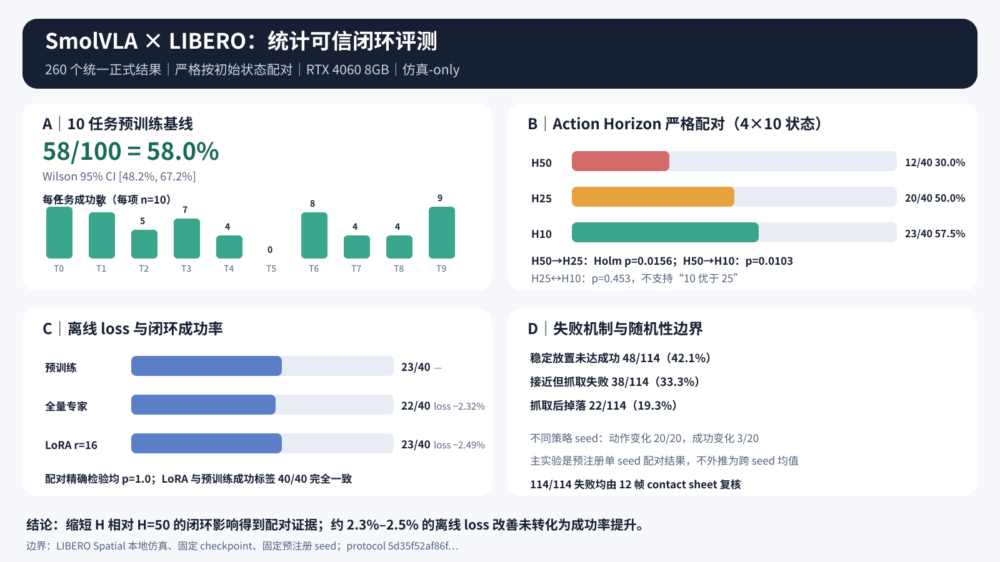
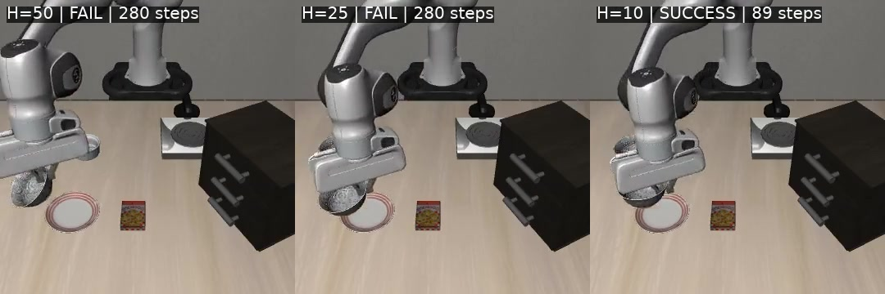
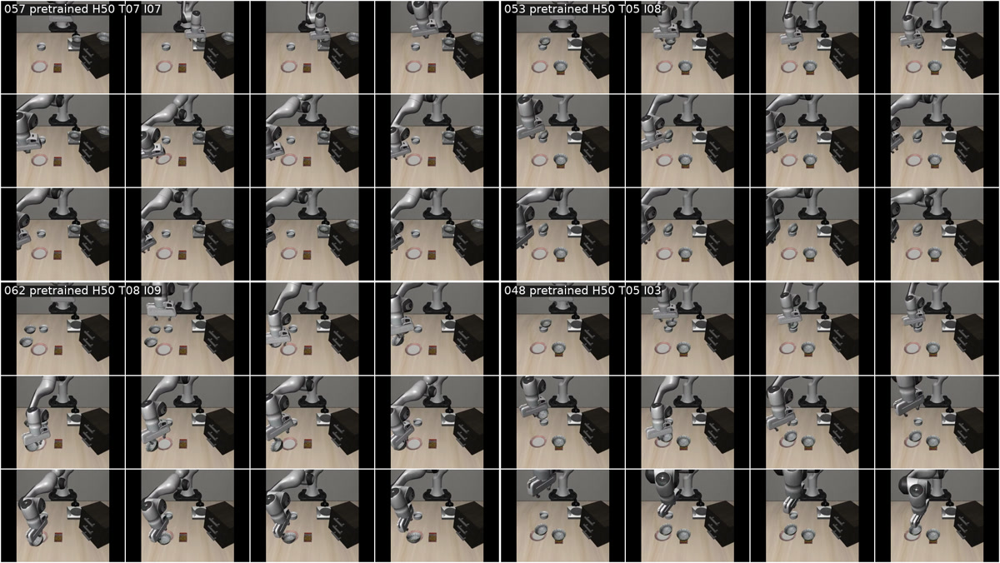

# SmolVLA × LIBERO 统计可信闭环评测

本报告记录 `feature/statistical-smolvla-evaluation` 分支的冻结协议、严格配对结果、随机性审计、
失败分类、训练/推理成本和公开产物。全部新增闭环运行均在一张 NVIDIA GeForce RTX 4060
Laptop GPU（8 GB）上完成；结果只代表本地 LIBERO Spatial 仿真，不是真机结果，也不等同于
SmolVLA 论文的官方完整 benchmark。



## 一页结论

- 10 个任务、每任务 10 个官方初始状态的预训练基线为 **58/100（58.0%）**，Wilson 95%
  CI 为 **[48.2%, 67.2%]**。
- 在 Task 4/5/7/8 的 40 个严格配对状态上，H=50、25、10 分别为 **12/40（30.0%）**、
  **20/40（50.0%）**、**23/40（57.5%）**。相对 H=50，H=25 与 H=10 的改善通过
  Holm 校正后的精确 McNemar 检验，`p=0.015625` 与 `p=0.010254`。
- H=10 相对 H=25 只有 5 个新增成功、2 个丢失成功，校正后 `p=0.453125`。因此本实验支持
  “缩短 H 相对 H=50 更好”，但**不支持**“H=10 显著优于 H=25”。
- 全量动作专家和 rank-16 LoRA 的离线验证 loss 分别下降 **2.32%** 和 **2.49%**，但 H=10
  闭环结果为 **22/40** 与 **23/40**，对照预训练的 **23/40**；三组配对比较的精确检验均
  `p=1.0`。LoRA 与预训练的 40 个成功/失败标签完全一致。
- 114 个正式失败全部经过 12 帧 contact sheet 复核。最常见主因是“已放置但未稳定满足成功”
  **48/114（42.1%）**，其次是“接近但抓取失败” **38/114（33.3%）** 和“抓取后掉落”
  **22/114（19.3%）**。
- 随机性审计固定环境状态、只改变策略采样 seed：20/20 个状态的动作哈希变化，12/20 的步数
  变化，3/20 的成功标签变化。因此主实验应解释为一个预注册 seed 下的配对效应，不能外推成
  跨 seed 的无条件均值。

这些结果支持项目主线的有限版本：**约 2.3%–2.5% 的离线 loss 改善没有转化为闭环成功率
提升，而相对 H=50 提高反馈/重规划频率对闭环成功有更直接的配对证据。**证据并不支持所有更短
H 都更好，也不支持从本地仿真直接外推到真实机器人。

## 冻结与样本账本

正式新增结果生成前，协议和失败 taxonomy 已提交到 Git：

- 冻结提交：`6cbc964`；
- 协议：[statistical_evaluation_v1.json](../protocols/statistical_evaluation_v1.json)；
- 协议 SHA-256：`5d35f52af86f240c665ffef15a2bff0622474375ba01dec0f60351c3936838b5`；
- taxonomy：[failure_taxonomy_v1.json](../protocols/failure_taxonomy_v1.json)；
- taxonomy SHA-256：`d25c82f987f8ffa6077d9d3a81a6c62494074b4b14a60eb8543c938659343879`。

冻结内容包括任务、官方初始状态、环境 seed、策略 RNG seed、checkpoint 哈希、Action Horizon、
280 步上限、LIBERO 原生成功判据、初始状态级统计单位、统计方法和十类失败机制。正式结果没有
用于改选状态、删回合、改主指标或换 checkpoint。

样本复用与新增账本：

| 项目 | 条件结果数 | 与其他实验复用 | 新增/历史来源 |
| --- | ---: | ---: | --- |
| A：10 任务 H=50 基线 | 100 | B 复用其中 40 | 70 新增 + 30 历史 |
| B：4 任务 H=50/25/10 | 120 | H=50 复用 A；H=10 被 C 复用 | 84 新增 + 36 历史 |
| C：预训练/全量/LoRA，H=10 | 120 | 预训练复用 B | 84 新增 + 36 历史 |
| 正式唯一 episode | **260** | 去重后 | **182 新增 + 78 历史** |
| 随机性审计 | 20 状态 × 3 seed | 复用 8 条主实验 | **52 新增** |

历史 init 0–2 来自已冻结的 batch=3 运行，策略 RNG 按任务固定；新增 init 3–9 为 batch=1，
策略 seed 按状态固定。每个状态内的不同条件遵循完全相同的冻结 RNG 合同，所有差异都保存在
[episodes.csv](../results/statistical_evaluation/episodes.csv) 中。不同批量合同之间不做伪造的
逐 episode 推理延迟对齐。

## A：扩大 10 任务预训练基线

固定 `lerobot/smolvla_libero` checkpoint 和 H=50，使用每任务官方 init 0–9：

| Task | 成功数 | 成功率 | Wilson 95% CI |
| ---: | ---: | ---: | ---: |
| 0 | 9/10 | 90% | [59.6%, 98.2%] |
| 1 | 8/10 | 80% | [49.0%, 94.3%] |
| 2 | 5/10 | 50% | [23.7%, 76.3%] |
| 3 | 7/10 | 70% | [39.7%, 89.2%] |
| 4 | 4/10 | 40% | [16.8%, 68.7%] |
| 5 | 0/10 | 0% | [0.0%, 27.8%] |
| 6 | 8/10 | 80% | [49.0%, 94.3%] |
| 7 | 4/10 | 40% | [16.8%, 68.7%] |
| 8 | 4/10 | 40% | [16.8%, 68.7%] |
| 9 | 9/10 | 90% | [59.6%, 98.2%] |
| **总体** | **58/100** | **58.0%** | **[48.2%, 67.2%]** |

成功回合的 steps-to-success 为 mean `104.93`、p50 `107`、p95 `129.15`；42 个失败回合全部
在 280 步上限右删失。每回合逻辑 VLM forward 数 mean `4.03`、p50 `3`、p95 `6`。

只在 70 个新增顺序运行回合上测量运行时：

- 单次 forward：mean `0.538 s`、p50 `0.534 s`、p95 `0.630 s`；
- episode wall-clock：mean `35.12 s`、p50 `30.22 s`、p95 `50.64 s`；
- 峰值推理显存：约 `972 MB`（十进制）/ `0.905 GiB`。

30 个历史回合的逐 episode 延迟、wall-clock 和显存为 `null`，没有补值或重跑。

## B：Action Horizon 严格配对

Task 4/5/7/8、init 0–9、相同环境 seed 和相同策略 RNG 合同下：

| H | 成功数 | 成功率 | Wilson 95% CI | 成功步数 mean / p50 | 逻辑 VLM forward mean |
| ---: | ---: | ---: | ---: | ---: | ---: |
| 50 | 12/40 | 30.0% | [18.1%, 45.4%] | 116.33 / 119 | 5.00 |
| 25 | 20/40 | 50.0% | [35.2%, 64.8%] | 111.75 / 115 | 8.48 |
| 10 | 23/40 | 57.5% | [42.2%, 71.5%] | 115.74 / 115 | 18.78 |

逐任务成功数：

| H | Task 4 | Task 5 | Task 7 | Task 8 |
| ---: | ---: | ---: | ---: | ---: |
| 50 | 4/10 | 0/10 | 4/10 | 4/10 |
| 25 | 6/10 | 0/10 | 7/10 | 7/10 |
| 10 | 6/10 | 0/10 | 9/10 | 8/10 |

二元成功的配对列联与精确 McNemar 检验：

| 比较 | 两者失败 | 前者独有成功 | 后者独有成功 | 两者成功 | raw p | Holm p |
| --- | ---: | ---: | ---: | ---: | ---: | ---: |
| H50 vs H25 | 20 | 0 | 8 | 12 | 0.007812 | **0.015625** |
| H50 vs H10 | 16 | 1 | 12 | 11 | 0.003418 | **0.010254** |
| H25 vs H10 | 15 | 2 | 5 | 18 | 0.453125 | 0.453125 |

以初始状态 pair 为单位做 10,000 次 bootstrap，差值方向均为“后者减前者”：

| 比较 | 全部 pair 控制步差 mean [95% CI] | 逻辑 forward 差 mean [95% CI] | 新增 pair wall-clock 差 |
| --- | ---: | ---: | ---: |
| H50→H25 | −35.03 [−57.48, −14.78] | +3.48 [+2.58, +4.33] | −1.49 s [−5.66, +2.02] |
| H50→H10 | −45.35 [−70.78, −21.12] | +13.78 [+11.43, +16.15] | −1.10 s [−6.34, +3.81] |
| H25→H10 | −10.33 [−30.28, +8.63] | +10.30 [+8.40, +12.20] | +0.38 s [−3.87, +4.71] |

wall-clock 区间都跨过 0，不能宣称更短 H 在本机上显著更快；它增加 VLM 调用，但更早成功和减少
280 步失败抵消了一部分计算成本。

[Task 8 / init 9 配对视频](../media/statistical_horizon_task8_init9.mp4) 同时展示 H=50 和 H=25
在 280 步失败、H=10 在 89 步成功。三段都使用环境 seed 1009、策略 seed 1009：

[](../media/statistical_horizon_task8_init9.mp4)

## C：离线 loss 与闭环成功率

三种策略固定 H=10，在同一 40 个任务-状态上比较：

| 策略 | Task 4 | Task 5 | Task 7 | Task 8 | 总体 | Wilson 95% CI |
| --- | ---: | ---: | ---: | ---: | ---: | ---: |
| 预训练 | 6/10 | 0/10 | 9/10 | 8/10 | **23/40（57.5%）** | [42.2%, 71.5%] |
| 全量动作专家 | 6/10 | 0/10 | 8/10 | 8/10 | **22/40（55.0%）** | [39.8%, 69.3%] |
| LoRA r=16 | 6/10 | 0/10 | 9/10 | 8/10 | **23/40（57.5%）** | [42.2%, 71.5%] |

| 比较 | 前者独有成功 | 后者独有成功 | 两者成功 | 两者失败 | exact / Holm p |
| --- | ---: | ---: | ---: | ---: | ---: |
| 预训练 vs 全量 | 1 | 0 | 22 | 17 | 1.0 / 1.0 |
| 预训练 vs LoRA | 0 | 0 | 23 | 17 | 1.0 / 1.0 |
| 全量 vs LoRA | 0 | 1 | 22 | 17 | 1.0 / 1.0 |

全量微调保留预训练的 22/23 条成功、丢失 1 条、没有新增；LoRA 保留 23/23、丢失 0、也没有
新增。Task 5 在三种策略下均为 0/10，说明两种适配都没有减少目标任务失败。

训练成本来自既有冻结 checkpoint，不重复训练：

| 指标 | 全量动作专家 | LoRA r=16 |
| --- | ---: | ---: |
| 验证 loss | 0.066339 → 0.064797（−2.32%） | 0.066339 → 0.064686（−2.49%） |
| 可训练参数 | 99,880,992 | 742,656 |
| 参数减少 | — | 99.26% |
| 训练时间 | 324.39 s | 279.24 s |
| 峰值训练显存 | 2.195 GB | 1.737 GB |
| 产物大小 | 906.71 MB | 3.00 MB |

新增顺序推理回合的描述性运行时：

| 策略 | 单 forward mean / p50 / p95 | episode wall mean / p50 / p95 | 峰值推理显存 |
| --- | ---: | ---: | ---: |
| 预训练 | 0.328 / 0.300 / 0.469 s | 40.25 / 31.62 / 56.60 s | 0.906 GiB |
| 全量动作专家 | 0.323 / 0.293 / 0.488 s | 41.02 / 31.80 / 57.69 s | 0.906 GiB |
| LoRA | 0.372 / 0.342 / 0.524 s | 41.41 / 34.13 / 58.73 s | 0.909 GiB |

这些运行时只覆盖每条件 28 个新增 episode；12 个历史 episode 为 `null`。没有对运行时做因果
优越性检验。

## 随机性审计

冻结子集为 Task 4/5/7/8 的 init 0–4，共 20 个任务-状态。环境 seed 始终为 `1000 + init`，
策略 seed 使用三个预注册系列：`1000 + init`、`2000 + init`、`3000 + init`。

| 指标 | 结果 |
| --- | ---: |
| 动作哈希随策略 seed 改变 | 20/20 |
| 控制步数随策略 seed 改变 | 12/20 |
| 成功标签随策略 seed 改变 | 3/20 |

相同 seed 的独立历史重复已经给出逐位一致证据，来源和哈希写入
[statistics.json](../results/statistical_evaluation/statistics.json)。因此推理路径不是无意义的
确定性重复；主结果保留单一预注册策略 seed，不用随机性子集机会性替换主结果。

## 失败分类

taxonomy 在新结果前冻结。每个失败 episode 生成 12 帧等间隔 contact sheet，复核者只根据可见
过程选择一个主要失败机制；完整标签在
[failure_annotations.csv](../results/statistical_evaluation/failure_annotations.csv)，紧凑的人工
标签源在 [failure_labels_v1.json](../annotations/failure_labels_v1.json)。标签顺序由 episode-ID
序列 SHA-256 锁定，避免 CSV 重排后静默错位。

总体分布：

| 主失败机制 | 数量 | 占失败比例 |
| --- | ---: | ---: |
| 已放置但未稳定满足成功条件 | 48 | 42.1% |
| 接近但抓取失败 | 38 | 33.3% |
| 成功抓取后掉落 | 22 | 19.3% |
| 放置位置错误 | 3 | 2.6% |
| 超时但仍有任务进展 | 2 | 1.8% |
| 对象或目标识别错误 | 1 | 0.9% |
| 其余四类 | 0 | 0.0% |

Action Horizon 的核心任务失败数：

| H | 总失败 | 抓取失败 | 抓取后掉落 | 放置未稳定 | 放置位置错误 | 进展中超时 |
| ---: | ---: | ---: | ---: | ---: | ---: | ---: |
| 50 | 28 | 9 | 5 | 10 | 3 | 1 |
| 25 | 20 | 8 | 7 | 5 | 0 | 0 |
| 10 | 17 | 7 | 3 | 7 | 0 | 0 |

H=50→H=10 的 11 个净新增成功伴随放置位置错误、进展中超时、掉落和抓取失败的绝对数量下降。
H=25→H=10 只减少 3 个总失败，且“放置未稳定”从 5 增至 7；这与两者成功率差异不显著一致。
分类是结果后的机制描述，不是第二个显著性检验。

方法间 H=10 失败数：

| 策略 | 总失败 | 抓取失败 | 抓取后掉落 | 放置未稳定 | 进展中超时 |
| --- | ---: | ---: | ---: | ---: | ---: |
| 预训练 | 17 | 7 | 3 | 7 | 0 |
| 全量动作专家 | 18 | 7 | 3 | 8 | 0 |
| LoRA | 17 | 4 | 4 | 8 | 1 |

全量微调没有减少 Task 5 或总体失败，并增加一条“放置未稳定”失败；LoRA 保持全部成功标签，但
改变了部分失败形式，不能被写成闭环提升。

以下公开 contact sheet 各选一条 H=50 的抓取失败、掉落、放置未稳定和放置位置错误案例；精确
episode、seed、源视频和哈希在
[media_manifest.json](../results/statistical_evaluation/media_manifest.json)：



## 统计方法

- 主要统计单位：官方 LIBERO 初始状态，不把控制步、动作块或重叠窗口当作独立样本。
- 成功率区间：Wilson score 95% CI。
- 成功二元配对：双侧 exact McNemar。
- 多重比较：B 与 C 各自三个预注册 pair 构成一个 family，使用 Holm 校正。
- 连续配对量：按任务-初始状态 pair 重采样 10,000 次，固定 bootstrap seed `20260727`。
- 失败分类：每个失败只记录一个主要语义类别；自动字段与人工语义来源分开保存。
- 右删失：所有未成功且达到 280 步的 episode 明确标记为 censored，不当作“280 步完成”。

## 代码、依赖与项目新增边界

沿用的官方实现：

- LeRobot 的 SmolVLA checkpoint、策略类、预处理/后处理和动作生成；
- LIBERO Spatial 的任务定义、官方初始状态和原生成功判据。

第三方依赖：

- PyTorch、Transformers、PEFT、NumPy；
- MuJoCo、robosuite、LIBERO；
- FFmpeg/ffprobe 和 Pillow。

本项目新增：

- [stage29_statistical_evaluation.py](../scripts/stage29_statistical_evaluation.py)：冻结 manifest 的
  可 resume 批量闭环运行、逐回合哈希、延迟/VLM 调用/显存记录；
- [stage30_analyze_statistical_evaluation.py](../scripts/stage30_analyze_statistical_evaluation.py)：
  历史结果哈希复用、统一逐回合表、Wilson、exact McNemar、Holm、pair bootstrap、随机性审计；
- [stage31_prepare_failure_review.py](../scripts/stage31_prepare_failure_review.py)：视频校验、contact
  sheet、人工标签顺序锁和完整性检查；
- [stage32_build_statistical_public_artifacts.py](../scripts/stage32_build_statistical_public_artifacts.py)：
  从公开 JSON/CSV 重建总览图、配对视频、失败样例和媒体 provenance；
- [test_statistical_evaluation.py](../tests/test_statistical_evaluation.py)：协议规模、resume 漂移、
  统计函数、taxonomy、采样端点和标签顺序锁测试。

本阶段没有训练新 VLM，没有实现自适应 H，也没有继续 WM detector/shield/residual 路线。已有 WM
负结果原样保留。

## 复现命令

从仓库根目录运行。Python 环境由 `/home/jump/projects/lerobot` 的 `uv` 环境管理，不使用 Conda。

```bash
PYTHON=/home/jump/projects/lerobot/.venv/bin/python

# 只读检查冻结规模；正式运行会逐 episode 原子写入并支持 resume
$PYTHON scripts/stage29_statistical_evaluation.py --mode formal --dry-run

HF_HUB_OFFLINE=1 TRANSFORMERS_OFFLINE=1 MUJOCO_GL=egl \
  $PYTHON scripts/stage29_statistical_evaluation.py --mode formal

HF_HUB_OFFLINE=1 TRANSFORMERS_OFFLINE=1 MUJOCO_GL=egl \
  $PYTHON scripts/stage29_statistical_evaluation.py --mode randomness

$PYTHON scripts/stage30_analyze_statistical_evaluation.py
$PYTHON scripts/stage31_prepare_failure_review.py --review-page-size 4 --apply-labels
```

总览 PNG 需要一个支持中文的字体。示例使用 Noto Sans CJK SC；字体只用于本地栅格化，不提交 Git：

```bash
$PYTHON scripts/stage32_build_statistical_public_artifacts.py \
  --cjk-font /path/to/NotoSansCJKsc-Regular.otf
```

原始 checkpoint、视频、轨迹和 114 张 contact sheet 位于 `outputs/` 并被 `.gitignore` 排除。Git
只提交协议、脚本、测试、轻量 CSV/JSON、报告与精选媒体。

## 公开结果索引

- [episodes.csv](../results/statistical_evaluation/episodes.csv)：260 个正式唯一 episode；
- [statistics.json](../results/statistical_evaluation/statistics.json)：每任务/总体、配对统计、
  随机性和失败分布；
- [paired_comparisons.csv](../results/statistical_evaluation/paired_comparisons.csv)：每个 pair 的
  列联 cell、步数、VLM 调用和 wall-clock 差；
- [action_horizon_by_state.csv](../results/statistical_evaluation/action_horizon_by_state.csv)；
- [adaptation_by_state.csv](../results/statistical_evaluation/adaptation_by_state.csv)；
- [randomness_by_state.csv](../results/statistical_evaluation/randomness_by_state.csv)；
- [failure_annotations.csv](../results/statistical_evaluation/failure_annotations.csv)；
- [costs.json](../results/statistical_evaluation/costs.json)；
- [media_manifest.json](../results/statistical_evaluation/media_manifest.json)。

CSV 中的 `external_asset_root/` 是冻结历史资产根目录的可移植占位符；Stage 31 通过
`--asset-root` 将其解析到本机缓存，不把 `/home/...` 绝对路径发布到 Git。

## 结论边界与简历表述

成立：

1. 在冻结的 40 个配对状态上，H=25 与 H=10 相对 H=50 的成功改善有精确配对证据；
2. 两种适配虽然降低离线 loss，却没有提升这 40 个状态的闭环成功率；
3. Task 5 的失败从 3 状态扩大到 10 状态后仍是三策略 0/10；
4. SmolVLA 的策略采样 seed 会改变动作，固定 seed 是本主实验的重要解释边界。

不成立或证据不足：

1. 不能声称 H=10 显著优于 H=25；
2. 不能声称 LoRA 提升闭环成功，只能说它以少 99.26% 的可训练参数保持了预训练成功标签；
3. 不能把 260 个本地仿真 episode 当作真机或官方 benchmark；
4. 不能从单一主 seed 外推跨 seed 的平均成功率。

推荐简历表述：

> 在单张 RTX 4060 8GB 上构建 SmolVLA × LIBERO 可恢复闭环评测与统计流水线，统一审计 260 个
> 正式 episode，并对 40 个初始状态做 Action Horizon 和模型适配严格配对；使用 Wilson CI、
> exact McNemar + Holm 和 10k pair bootstrap，验证 H=25/H=10 相对 H=50 的成功改善
> （Holm `p=0.0156/0.0103`），同时发现约 2.3%–2.5% 的离线 loss 下降未转化为闭环提升；
> 完成 114/114 失败视频分类、20 状态×3 seed 随机性审计和全链路哈希/resume 验证。
