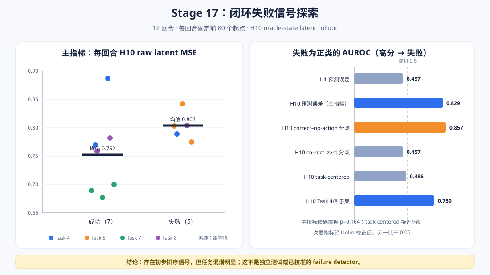

# WM 阶段 7：闭环失败信号探索

Stage 16 已回采 12 个包含同步双相机、完整 robot state、动作和成功标签的 SmolVLA 闭环
episode。本阶段冻结 DINOv2 encoder 与 Stage 14 dynamics，不训练分类器，回答一个更窄的
问题：

> 在控制 episode 长度和 rollout 起点数量后，latent dynamics error 或 action disagreement
> 是否对闭环失败表现出初步排序能力？

答案是：**存在初步排序信号，但任务混淆明显，尚不能称为 failure detector。**



## 防混淆协议

失败回合全部运行到 280 步，而成功回合会提前终止。如果直接对完整轨迹求均值，episode 长度
本身就能完美预测失败，任何相关指标都可能得到虚高结果。

因此在查看结果前固定：

| 项目 | 设置 |
| --- | --- |
| Episode | 12（7 成功、5 失败） |
| Task | 4、5、7、8 |
| 每回合 rollout 起点 | 前 80 个 |
| Horizon | H1、H10 |
| 总窗口数 | 960 |
| 主指标 | H10 action-conditioned raw latent MSE |
| 失败方向 | 分数越高越可能失败，不允许事后翻转 |
| 状态输入 | 每个递归步使用 oracle ground-truth state |
| 参数更新 | 0 |
| 专家 test episode 使用数 | 0 |

最短 episode 有 90 条有效 transition，H10 的 80 个起点只需要前 89 条，因此所有回合都使用
完全相同的窗口范围，不接触成功后的自动 reset transition。

Task 5 只有失败、Task 7 只有成功，是明显的 task-label confounding。除 pooled 统计外，本阶段
同时报告：

- 对每个 task 内分数去均值后的 task-centered AUROC；
- 只使用同时包含成功/失败的 Task 4 与 Task 8 的六回合结果；
- 以 episode 为统计单位的精确标签置换，而不把 960 个重叠窗口当成独立样本。

## 表征对齐与缓存

Stage 16 保存的是环境原始相机图像；SmolVLA 的 `LiberoProcessorStep` 会将两路图像旋转
180°，并将 end-effector quaternion 转成 axis-angle。Stage 17 复用相同约定：

- 双相机先同时翻转 height/width，再进入固定 revision 的 DINOv2-S/14；
- state 采用 `eef_pos(3) + eef_axisangle(3) + gripper_qpos(2)`；
- 每相机池化为 16 个 384 维 token，与 Stage 13 完全一致；
- encoder batch size 固定为 16，并写入每个 shard 的 metadata。

最终生成 12 个 episode 级 Safetensors shard，共 54,656,502 字节，约 52.1 MiB。最短 episode
在相同 batch size 下重新编码，pixel hash 和 FP16 visual tokens 均 bit-exact。

## 主指标结果

主指标是每个 episode 前 80 个起点的 H10 action-conditioned raw latent MSE 均值：

| 统计量 | 结果 |
| --- | ---: |
| 成功均值 | 0.752069 |
| 失败均值 | 0.802729 |
| 失败 − 成功 | +0.050660 |
| 失败/成功比 | 1.067 |
| Failure AUROC | **0.829** |
| Stratified bootstrap 95% CI | [0.543, 1.000] |
| Hedges' g | +0.801 |
| 792 种精确置换双侧 p | 0.164 |
| Task-centered AUROC | **0.486** |

Pooled AUROC 和效应量方向支持“失败轨迹更难预测”的假设，但精确置换未达到 0.05，且
task-centered 后降到近似随机。这说明 pooled 排序很可能利用了任务差异。

### 只看混合标签 Task 4/8

Task 4 与 Task 8 共 6 个 episode，包含 4 成功和 2 失败：

| 统计量 | 结果 |
| --- | ---: |
| Failure AUROC | 0.750 |
| 失败 − 成功均值 | -0.002644 |
| 15 种精确置换双侧 p | 1.000 |

虽然 rank-based AUROC 高于 0.5，但均值方向不稳定且样本极少，不能作为任务内失败检测证据。

## 固定前缀时间分段

| 起点范围 | 成功 H10 MSE | 失败 H10 MSE |
| --- | ---: | ---: |
| 0—19 | 0.716391 | 0.791228 |
| 20—39 | 0.793390 | 0.856155 |
| 40—59 | 0.746376 | 0.771181 |
| 60—79 | 0.752119 | 0.792352 |

四个区间的 pooled failure mean 都更高，但这仍未消除 task-label confounding。

## 次要指标与多重比较

| 分数 | Failure AUROC | 原始置换 p | Holm 校正 p |
| --- | ---: | ---: | ---: |
| H1 raw MSE | 0.457 | 0.669 | 1.000 |
| H10 correct–zero disagreement | 0.457 | 0.777 | 1.000 |
| H10 correct–no-action disagreement | 0.857 | 0.028 | 0.111 |
| H10 action advantage vs zero | 0.143 | 0.011 | 0.057 |
| H10 persistence MSE | 0.171 | 0.080 | 0.239 |

`correct–no-action disagreement` 的原始结果最强，但它属于五个次要指标之一；Holm family-wise
error 校正后没有任何次要指标低于 0.05。因此不能从中挑选一个并宣称显著。

`action advantage vs zero` 在失败回合反而更低，说明失败状态中动作条件信息可能更少，但该
方向不是预先规定的“高分即失败”，也没有通过校正。

## Episode 长度负对照

直接使用 `steps` 预测失败得到 AUROC 1.0、精确置换 `p=0.00126`。这不是有价值的失败预警：
LIBERO 的失败定义本身就是运行到 280 步时限。该结果验证了为什么必须使用固定 80 起点，而
不能报告完整轨迹长度相关分数。

## 本机资源与复现

正式 batch-16 运行在 RTX 4060 Laptop GPU（8 GB）上：

- 12 个 feature shard 编码与 bit-exact 重算约 27.94 秒；
- 特征、train-only normalization、dynamics 评分和统计总计约 42.90 秒；
- 峰值 PyTorch GPU allocation 为 202,168,832 字节，约 192.8 MiB。

```bash
HF_HUB_OFFLINE=1 TRANSFORMERS_OFFLINE=1 \
uv run --no-sync python scripts/wm/stage17_failure_signal.py
```

公开结果位于
[`results/wm/stage17_failure_signal`](../results/wm/stage17_failure_signal)：

- `feature_manifest.csv`：12 个本地 feature shard 的来源与哈希；
- `episode_scores.csv`：episode 级六组固定前缀分数；
- `window_scores.csv`：960 个起点的完整分数；
- `time_bins.csv`：四段固定前缀趋势；
- `statistics.json`：AUROC、bootstrap、效应量、精确置换和 Holm 校正；
- `report.json`：协议、主结论、边界和 readiness。

## 结论与下一阶段

本阶段没有得到可以直接部署或写成“成功预测失败”的结果：

- H10 主分数有 pooled 排序能力，但主检验 `p=0.164`；
- task-centered AUROC 为 0.486，任务差异解释力很强；
- 混合标签任务只有 6 个 episode；
- 次要指标没有通过 Holm 校正；
- 所有 rollout 都使用 oracle state，且不是独立 held-out 评测。

下一步不应马上训练 failure classifier。更合理的是先冻结本阶段的分数定义，再增加每个 task
内部同时包含成功/失败的自然初始状态，建立 label-balanced、episode-disjoint 的 calibration
与 test cohort。只有 H10 error 或 disagreement 在跨 task 留出评测中仍稳定，才值得继续做
在线预警或 WM-guided action selection。
