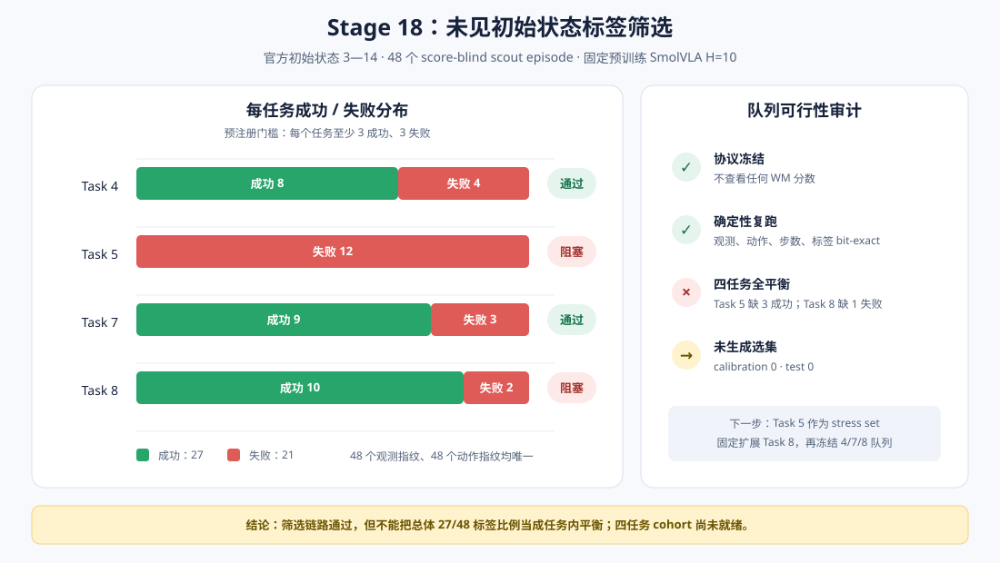

# WM 阶段 8：未见初始状态标签筛选

Stage 17 在 12 个闭环 episode 上得到 H10 error pooled AUROC 0.829，但 task-centered AUROC
只有 0.486。主要原因是 Task 5 只有失败、Task 7 只有成功，任务身份和成败标签发生混淆。

本阶段不计算任何 WM 分数，也不训练分类器，而是先回答更基础的问题：

> 在未被 Stage 17 使用的 LIBERO 官方初始状态中，能否为四个任务都构建任务内成功/失败
> 平衡、episode-disjoint 的 calibration/test 队列？

答案是：**筛选与确定性审计完整通过，但预注册的四任务平衡门槛没有通过。**



## 预注册协议

LIBERO Spatial 每个任务包含 50 个固定的官方初始状态。先前闭环实验只使用索引 0—2，本阶段在
查看新结果前固定：

| 项目 | 设置 |
| --- | --- |
| Task | 4、5、7、8 |
| 新初始状态 | 每任务索引 3—14，共 12 个 |
| Episode | 48 |
| 策略 | 固定预训练 SmolVLA，H=10 |
| 推理 batch | 1 |
| 每回合 seed | `180000 + task_id × 100 + init_state_index` |
| 完整图像保存 | 否，仅保存标签、步数与指纹 |
| WM 分数计算 | 0 |
| 专家 test episode 使用 | 0 |
| 单任务入选门槛 | 至少 3 成功、3 失败 |

使用 batch 1 是为了让每个 episode 的策略随机数流独立于其他候选，后续完整观测回采可以按相同
seed 单独重放。每条记录保存初始观测 SHA-256 和实际执行动作序列 SHA-256。

若四个任务全部达标，预注册选择规则才会生效：在每个 task/label cell 内，按固定 salt 与
episode key 的 SHA-256 排序，取前 3 个；前 2 个进入 calibration，最后 1 个进入 test。
排序不读取 Stage 17 或任何其他 WM 分数。

## 筛选结果

| Task | 成功 | 失败 | 门槛 | 结论 |
| ---: | ---: | ---: | --- | --- |
| 4 | 8 | 4 | ≥3 / ≥3 | 通过 |
| 5 | 0 | 12 | ≥3 / ≥3 | 不通过：缺 3 个成功 |
| 7 | 9 | 3 | ≥3 / ≥3 | 通过 |
| 8 | 10 | 2 | ≥3 / ≥3 | 不通过：缺 1 个失败 |
| **合计** | **27** | **21** | 四任务均通过 | **未通过** |

Task 7 的旧索引 0—2 全部成功，但新状态中出现 3 个失败，证明扩大初始状态覆盖确实能够发现
任务内行为变化。Task 5 则相反：旧 0—2 和新 3—14 合计 15 个状态均失败，说明它在当前策略
下更像能力地板，而不是适合构建同策略 failure AUROC 的平衡 cell。

Task 8 已有任务内混合标签，但预注册要求是 3 个失败，不能因为只差一个就事后把门槛降到 2。
因此没有生成 `selected_episodes.csv`，也没有开始完整观测回采。

## 分数冻结与防止结果泄漏

Stage 18 开始前固定并记录：

- Stage 17 主分数仍为 `h10_raw_mse`；
- 失败方向仍为“分数越高越可能失败”；
- Stage 17 报告 SHA-256 为
  `06859d1835154393488a678fda8fefb42f1ba48ea8bb0d07fef4be6802314e5a`；
- 本阶段不加载 DINOv2、不加载 dynamics checkpoint、不计算阈值；
- Stage 16 的 12 个探索 episode 不进入新 cohort。

所以本阶段虽然知道成功标签——标签筛选本身必须知道标签——但没有用 WM 预测分数挑选有利样本。
未来 test cohort 可以做到 score-blind，但不能宣称 label-blind。

## 确定性与资源

预指定复跑 Task 4 / init 3，以下字段与首次执行逐位一致：

- 成功标签；
- 控制步数；
- 初始双相机与机器人状态指纹；
- 完整动作序列指纹。

48 个初始观测指纹和 48 个动作指纹均唯一。首次正式扫描约 30.4 分钟，随后确定性复跑约 1 分钟；
峰值 PyTorch GPU allocation 约 927 MiB。整个过程运行在 RTX 4060 Laptop GPU（8 GB）上，
没有保存大体积观测缓存。

```bash
HF_HUB_OFFLINE=1 TRANSFORMERS_OFFLINE=1 MUJOCO_GL=egl \
uv run --no-sync python scripts/wm/stage18_initial_state_scout.py
```

公开结果位于
[`results/wm/stage18_initial_state_scout`](../results/wm/stage18_initial_state_scout)：

- `scout_episodes.csv`：48 个 episode 的标签、步数、seed 与两类指纹；
- `report.json`：冻结协议、逐任务平衡门槛、阻塞 cell 与确定性审计。

本地 `outputs/wm/stage18_initial_state_scout` 只保存可断点续跑的 episode JSON 和运行时信息，
不提交 checkpoint 或原始观测。

## 结论与下一阶段

本阶段拒绝把 27/48 的总体标签比例误写成“四任务平衡”。Task 4、7 已达标；Task 8 只差一个
失败；Task 5 在 15 个已测官方状态上持续失败。

下一阶段更合理的修订不是无限搜索 Task 5 的成功案例，而是预先固定：

1. Task 5 作为策略能力地板和外部 stress set，仅报告，不进入任务内 AUROC；
2. 对 Task 8 完整扫描下一块官方状态 15—26，而不是找到一个失败就提前停止；
3. 若 Task 8 达标，则在 Task 4、7、8 上冻结 3 成功/3 失败的队列；
4. 再回采完整双相机观测，并按 scout 动作哈希验证逐回合复现。

只有完成上述队列冻结，才进入 calibration threshold 与 held-out test 评测。
