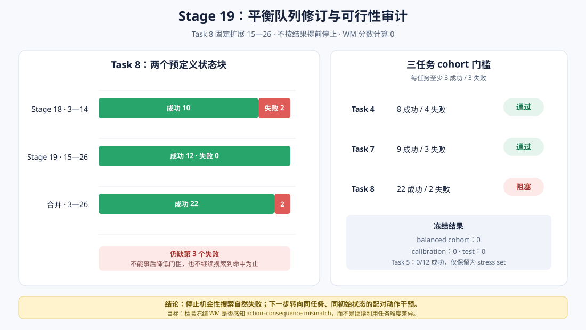

# WM 阶段 9：平衡队列修订与可行性审计

Stage 18 在 Task 4/5/7/8 的官方初始状态 3—14 上得到 27 成功/21 失败，但只有 Task 4、7
达到每任务至少 3 成功/3 失败。Task 5 为 0/12 成功，Task 8 为 10/12 成功。

本阶段按 Stage 18 公开的下一步方案，先把 Task 5 固定为能力地板 stress set，再完整扫描
Task 8 的下一块官方初始状态 15—26，尝试冻结 Task 4/7/8 的 score-blind 平衡队列。

结论是：**Task 8 扩展块 12/12 全部成功，三任务队列仍未达到预注册门槛。**



## 修订协议

在查看 Task 8 新标签前固定：

| 项目 | 设置 |
| --- | --- |
| 扩展任务 | Task 8 |
| 扩展初始状态 | 官方索引 15—26，共 12 个 |
| 停止规则 | 必须完成整块，不允许找到失败后提前停止 |
| 候选 cohort | Task 4、7、8 |
| Task 5 | policy-floor stress set，不进入 AUROC |
| 单任务门槛 | 至少 3 成功、3 失败 |
| 入选数 | 每任务/标签固定 3 个 |
| Calibration | 每任务 2 成功、2 失败，共 12 个 |
| Test | 每任务 1 成功、1 失败，共 6 个 |
| 排序规则 | 固定 salt 与 episode key 的 SHA-256 |
| WM 分数计算 | 0 |
| 阈值拟合 | 0 |

Stage 17 的主分数继续冻结为 `h10_raw_mse`，失败方向继续固定为“分数越高越可能失败”。
选择规则不读取任何 WM 分数。

## Task 8 扩展结果

| 初始状态范围 | 成功 | 失败 | 成功率 |
| --- | ---: | ---: | ---: |
| Stage 18：3—14 | 10 | 2 | 83.3% |
| Stage 19：15—26 | **12** | **0** | **100.0%** |
| 合并：3—26 | **22** | **2** | **91.7%** |

扩展块没有提供所需的第三个失败。由于预注册门槛是 3 个失败，不能把门槛事后降低到 2，也不能
继续逐个搜索直到碰到失败。因此没有生成 `balanced_cohort.csv`。

## 三任务门槛审计

| Task | 候选成功 | 候选失败 | 门槛 | 状态 |
| ---: | ---: | ---: | --- | --- |
| 4 | 8 | 4 | ≥3 / ≥3 | 通过 |
| 7 | 9 | 3 | ≥3 / ≥3 | 通过 |
| 8 | 22 | 2 | ≥3 / ≥3 | 不通过：缺 1 个失败 |

Task 4/7 的自然失败足以组成两任务小样本队列，但按本阶段预注册的三任务协议，整体状态仍为
`insufficient_balance`。Calibration 和 test 均保持为空。

## Task 5 能力地板

Stage 18 的 Task 5 / init 3—14 共 12 条全部失败。本阶段将这 12 条固定输出为
`task5_stress_set.csv`：

- 0 成功、12 失败；
- 不把“任务身份”伪装成 failure label；
- 不进入任务内 AUROC 或阈值 calibration；
- 未来只能作为“极难任务上的外部压力测试”报告。

这种处理避免了 Stage 17 中 Task 5 全失败、Task 7 全成功造成的任务—标签混淆。

## 确定性与资源

预指定复跑 Task 8 / init 15，以下字段逐位一致：

- 成功标签；
- 控制步数；
- 初始双相机与机器人状态指纹；
- 完整动作序列指纹。

正式扩展与复跑共约 322 秒，峰值 PyTorch GPU allocation 约 927 MiB，仍在 RTX 4060
Laptop GPU（8 GB）上完成。完整观测没有保存，因此本阶段几乎不增加大体积缓存。

```bash
HF_HUB_OFFLINE=1 TRANSFORMERS_OFFLINE=1 MUJOCO_GL=egl \
uv run --no-sync python scripts/wm/stage19_freeze_balanced_cohort.py
```

公开结果位于
[`results/wm/stage19_balanced_cohort`](../results/wm/stage19_balanced_cohort)：

- `task8_extension.csv`：12 条 Task 8 扩展标签与复现指纹；
- `task5_stress_set.csv`：固定的 Task 5 能力地板集合；
- `report.json`：协议、门槛审计、确定性与 readiness。

## 为什么停止继续搜索自然失败

Task 8 在状态 3—26 上已有 22 成功、2 失败。如果继续逐个扫描，直到出现第三个失败才停止，
选集将受到 outcome-dependent stopping 影响；这会人为提高失败样本的存在感，却不能代表一个
预先定义的测试分布。

两轮可行性审计已经说明：当前策略在不同任务上存在明显的能力地板和天花板。仅依赖自然成败
标签，很难在本地预算内同时获得多任务平衡和足够统计功效。

## 结论与下一阶段

本阶段没有把失败的 cohort 假设包装成成功。更合理的下一步是转向**同任务、同初始状态的配对
动作干预 pilot**：

1. 预先选择能稳定成功的初始状态；
2. 对每个状态运行 nominal 与固定时间结构的 action-delay/no-op 干预；
3. 保存完整双相机、状态和实际动作；
4. 检验冻结 WM error 是否在干预后、任务失败前显著升高；
5. 以 episode pair 为统计单位，不把重叠窗口当独立样本。

这种设计不能替代自然失败检测，但能以更强的因果控制回答：冻结的 action-conditioned world
model 是否真正感知“动作—视觉后果不一致”。若结果成立，才值得继续做 WM-guided shield 或
action selection。
