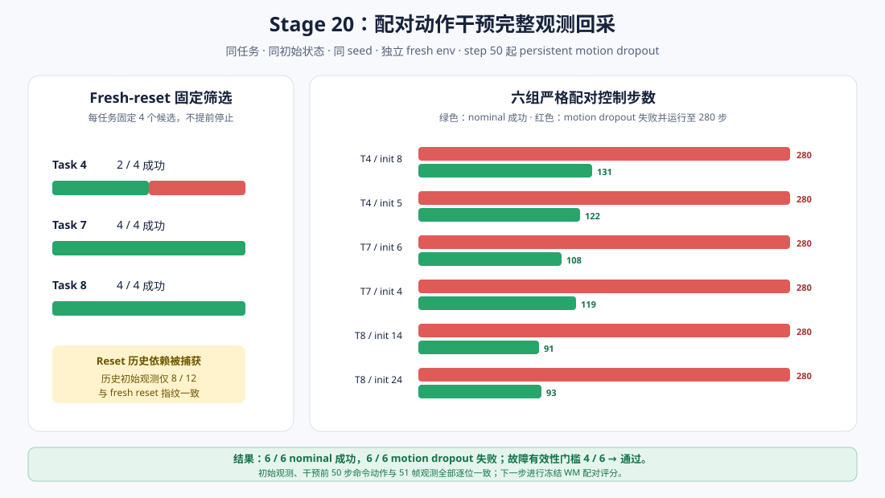

# WM 阶段 10：配对动作干预完整观测回采

Stage 18—19 证明，仅依赖自然成功/失败会遇到明显的任务能力地板与天花板：Task 5 在筛选范围内
持续失败，Task 8 在官方状态 3—26 上达到 22 成功/2 失败。继续搜索稀有失败会引入
outcome-dependent stopping。

本阶段转向一个更受控的问题：

> 在同任务、同初始状态、同随机 seed 下，固定的执行器 motion dropout 是否能够构造严格配对的
> action–consequence mismatch，并为冻结 WM 评分提供完整观测？

答案是：**可以。6/6 nominal 成功，6/6 motion-dropout 失败，且干预前轨迹逐位一致。**



## 干预定义

策略仍以 H=10 闭环运行。每个选中状态分别运行：

- `nominal`：策略命令动作直接交给 LIBERO；
- `persistent_motion_dropout`：从零基控制步 50 开始，环境实际执行动作的前 6 个机械臂运动维度
  固定为 0，夹爪维度保留策略命令值，直到 episode 结束。

每个故障回合同时保存：

- `commanded_action`：SmolVLA 实际输出的后处理动作；
- `executed_action`：真正传给 LIBERO 的动作；
- `intervention_mask`：从控制步 50 起为真；
- 同步双相机、完整 robot state、reward、success、done 和 transition-valid mask。

因此下一阶段可以让 action-conditioned WM 使用 `commanded_action` 预测实际后果，直接检验
“命令动作与观测后果不一致”，也可以使用 `executed_action` 作为诊断对照。

## Fresh-reset 历史依赖审计

首次尝试直接复用 Stage 18 的 Task 4 / init 10 标签时，发现：

- Stage 18 连续环境实例中为 129 步成功；
- Stage 20 全新环境实例中为 280 步失败；
- 初始观测 SHA-256 不同。

这条不对齐轨迹没有进入正式结果，仅保留在本地隔离目录。正式协议随后冻结为：

1. 每个任务按与 WM 分数无关的固定哈希顺序取 4 个历史成功候选；
2. 12 个候选全部使用独立的全新环境实例重新筛选，不提前停止；
3. 每任务取 fresh-reset 筛选中最先成功且成功步数大于 50 的 2 个；
4. 每个正式 nominal/fault condition 再使用独立全新环境实例。

筛选结果：

| Task | Fresh-reset 成功 | 候选 | 冻结状态 |
| ---: | ---: | ---: | --- |
| 4 | 2 | 4 | init 8、5 |
| 7 | 4 | 4 | init 6、4 |
| 8 | 4 | 4 | init 14、24 |
| **合计** | **10** | **12** | **6 对** |

12 个历史 scout 初始观测中只有 8 个与 fresh reset 指纹一致。这个结果说明，在仿真闭环研究中，
记录 task/init/seed 仍不一定足够，fresh environment instance 与初始观测内容哈希同样重要。

## 配对干预结果

| Pair | Nominal | Motion dropout | 步数差 | 故障导致失败 |
| --- | ---: | ---: | ---: | --- |
| Task 4 / init 8 | 成功，131 步 | 失败，280 步 | +149 | 是 |
| Task 4 / init 5 | 成功，122 步 | 失败，280 步 | +158 | 是 |
| Task 7 / init 6 | 成功，108 步 | 失败，280 步 | +172 | 是 |
| Task 7 / init 4 | 成功，119 步 | 失败，280 步 | +161 | 是 |
| Task 8 / init 14 | 成功，91 步 | 失败，280 步 | +189 | 是 |
| Task 8 / init 24 | 成功，93 步 | 失败，280 步 | +187 | 是 |

预注册有效性门槛是至少 4/6 故障导致失败，实际为 **6/6**。

六组配对还同时满足：

- nominal 完整复现 fresh-reset screen 的初始观测、动作哈希、步数和成功标签；
- nominal/fault 初始观测指纹一致；
- 干预前 50 步 commanded action 逐位一致；
- 干预前 51 帧双相机与完整状态逐位一致；
- 成功回合的自动 reset crossing transition 被保留审计但标记为无效。

## 数据规模与资源

| 项目 | 数量 |
| --- | ---: |
| Fresh-reset 轻量筛选 | 12 episode |
| 完整观测配对 | 6 对 / 12 episode |
| 完整观测帧 | 2,356 |
| 双相机图像 | 4,712 |
| 控制步 | 2,344 |
| 有效 WM transition | 2,338 |
| 原始压缩归档 | 659,350,899 bytes，约 629 MiB |

首次正式筛选与采集约 887.5 秒，峰值 PyTorch GPU allocation 约 927 MiB；在 RTX 4060
Laptop GPU（8 GB）上完成。无覆盖 resume 会重新读取并验证全部归档内容哈希，得到相同公开结果。

```bash
HF_HUB_OFFLINE=1 TRANSFORMERS_OFFLINE=1 MUJOCO_GL=egl \
uv run --no-sync python scripts/wm/stage20_collect_paired_interventions.py
```

公开结果位于
[`results/wm/stage20_paired_interventions`](../results/wm/stage20_paired_interventions)：

- `fresh_reset_screen.csv`：12 个候选的独立环境筛选与历史指纹对照；
- `pairs.csv`：六组配对的结果与四类对齐检查；
- `episodes.csv`：12 个完整观测归档的标签、哈希和模态 manifest；
- `report.json`：正式协议、故障有效性、资源与 Stage 21 readiness。

原始 NPZ 仅保存在 `outputs/wm/stage20_paired_interventions`，不提交 Git。

## 结论边界与下一阶段

本阶段得到的是**合成执行器故障数据**，不是自然策略失败检测结果。Persistent dropout 从步 50
持续到结束，是一个强干预；6 对样本也不足以训练或宣称通用 detector。

下一阶段将继续冻结 Stage 14 dynamics 和 Stage 17 的分数方向，在每对共同窗口上预先固定：

- pre-intervention：H10 起点 10—39，预测终点不跨过干预；
- post-intervention：H10 起点 50—79；
- 主指标：使用 commanded action 的 H10 raw latent MSE；
- 主统计：`fault(post−pre) − nominal(post−pre)` 的 episode-pair 差分；
- executed-action、no-action 和 persistence 仅作为诊断对照；
- 以 6 个 episode pair 为统计单位，不把重叠窗口视为独立样本。

如果 commanded-action error 在故障后稳定上升，而 executed-action 对照更弱，才能支持 WM 确实
捕获 action–consequence mismatch，并进一步讨论 WM-guided shield。
