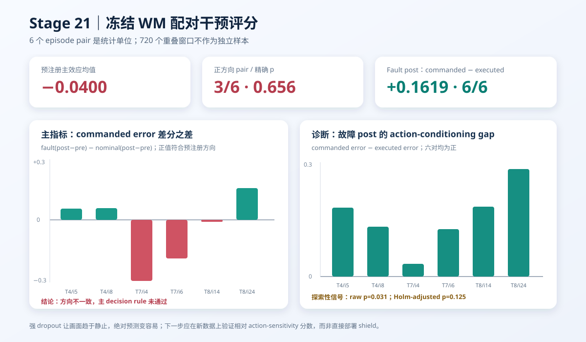

# WM 阶段 11：冻结 WM 配对干预评分

Stage 20 构造了 6 组同任务、同初始状态、同 seed 的 nominal / persistent motion-dropout
配对轨迹。本阶段不再训练模型，而是回答一个预先固定的问题：

> Stage 14 的冻结 action-conditioned latent dynamics，能否仅凭更高的 H10 预测误差识别
> commanded action 与实际观测后果不一致？

预注册主检验的答案是：**不能。** 主差分均值为 **−0.0400**，仅 3/6 对为正，精确符号翻转
检验 `p=0.65625`，95% paired-bootstrap CI 为 `[-0.1806, 0.0820]`。



## 冻结协议

全部 12 个 episode 使用完全相同的冻结组件：

- 视觉编码器：`facebook/dinov2-small`，revision
  `ed25f3a31f01632728cabb09d1542f84ab7b0056`；
- dynamics：Stage 14 的 action-conditioned 与 no-action best checkpoint；
- normalization：只由 Stage 13 的 346 个 train episode 计算；
- 模型更新参数：0；
- classifier 与阈值拟合：0；
- 专家 test episode：0。

每个 episode 固定评测两段 H10 recursive rollout：

| 窗口 | 起点 | 数量 | 与干预关系 |
| --- | ---: | ---: | --- |
| Pre | 10—39 | 30 | 最晚终点为 49，不跨越 step 50 |
| Post | 50—79 | 30 | 从干预动作开始后的共同区间 |

递归预测每一步使用对应轨迹的 oracle robot state。720 个重叠窗口只用于计算 episode-period
均值；统计推断始终以 **6 个 episode pair** 为单位，而不是把窗口当作 720 个独立样本。

主指标为 commanded-action H10 raw latent MSE，主效应为：

```text
fault(post − pre) − nominal(post − pre)
```

正值才符合“故障使 commanded-action 预测误差额外升高”的预注册方向。Executed-action、
no-action、persistence 和 fault-post 的 commanded-minus-executed gap 都只作为诊断。

## 主检验结果

| Pair | Task | Commanded error 的差分之差 | 预注册方向 |
| --- | ---: | ---: | --- |
| init 5 | 4 | +0.0567 | 是 |
| init 8 | 4 | +0.0594 | 是 |
| init 4 | 7 | −0.3116 | 否 |
| init 6 | 7 | −0.1975 | 否 |
| init 14 | 8 | −0.0108 | 否 |
| init 24 | 8 | +0.1637 | 是 |
| **Pair 均值** | — | **−0.0400** | **3/6** |

| 主统计 | 结果 |
| --- | ---: |
| Pair mean | −0.0400 |
| Pair median | +0.0230 |
| 95% paired-bootstrap CI | [−0.1806, +0.0820] |
| Paired effect `d_z` | −0.224 |
| 精确符号翻转 `p` | 0.65625 |
| 预注册 decision rule | **未通过** |

任务异质性明显：Task 4 两对均值为 +0.0580，Task 8 为 +0.0765，而 Task 7 为 −0.2545。
因此不能用 pooled window 数量掩盖 pair/task 层面的方向不一致。

## 诊断结果与失败机制

故障 post 段的 commanded error 减去 executed error 为：

| Pair | Commanded − executed |
| --- | ---: |
| Task 4 / init 5 | +0.1884 |
| Task 4 / init 8 | +0.1355 |
| Task 7 / init 4 | +0.0348 |
| Task 7 / init 6 | +0.1296 |
| Task 8 / init 14 | +0.1900 |
| Task 8 / init 24 | +0.2932 |
| **Pair 均值** | **+0.1619** |

该诊断 6/6 同向，95% CI 为 `[0.1018, 0.2236]`，未经校正的精确 `p=0.03125`。这说明
同一故障观测下，使用真实 executed action 的预测确实比使用未执行的 commanded action 更接近
未来表征，是一个值得继续验证的 action-sensitivity 现象。

但它不能替代失败的主检验：

- commanded-minus-executed 是预注册的诊断项，不是主指标；
- 与其余三个诊断组成的 family 做 Holm 校正后，调整 `p=0.125`；
- 没有任何诊断在 family-wise 0.05 水平下保留显著性。

更关键的是，persistent motion dropout 让机械臂在 post 段大幅减少运动，使未来图像变得更容易
预测。Persistence 的差分之差为 **−0.7592**，6/6 为负；executed-action error 的差分之差也为
**−0.2019**，6/6 为负。因此“故障轨迹绝对误差更低”并不意味着 WM 更相信故障，而是强干预
同时改变了视觉运动难度。只用绝对 prediction error 会把 action mismatch 和 scene motion
混在一起。

## 对齐与确定性审计

- 12/12 原始 NPZ 的 SHA-256 与 Stage 20 manifest 一致；
- nominal 的 commanded/executed 分数全程逐位相同；
- fault pre 段的 commanded/executed 分数逐位相同；
- 最短 episode 重新执行 DINOv2 编码，与缓存 token 逐位相同；
- 12 个特征 shard 共 58,127,024 bytes，约 55.4 MiB；
- 冷启动编码、确定性重算与评分约 29.1 秒，RTX 4060 Laptop GPU 峰值 PyTorch allocation
  约 193 MiB；缓存 resume 约 3.7 秒。

运行命令：

```bash
HF_HUB_OFFLINE=1 TRANSFORMERS_OFFLINE=1 \
uv run --no-sync python scripts/wm/stage21_paired_wm_scoring.py
```

公开结果位于
[`results/wm/stage21_paired_wm_scoring`](../results/wm/stage21_paired_wm_scoring)：

- `window_scores.csv`：12 × 60 个窗口的四类 H10 分数；
- `episode_period_scores.csv`：每个 episode 的 pre/post 聚合；
- `pair_effects.csv`：六个统计单位的差分之差；
- `statistics.json`：精确检验、paired bootstrap 与 Holm 校正；
- `feature_manifest.csv`：本地特征 shard 的来源、尺寸和哈希；
- `report.json`：协议、冻结组件、负对照、结论和限制。

原始特征只保存在 `outputs/wm/stage21_paired_wm_scoring`，不提交 Git。

## 结论边界与下一步

本阶段是一个有信息量的负结果：冻结 Stage 14 WM 的**绝对 commanded-action prediction
error 不能直接作为该故障的 detector 或 shield 分数**，所以不应马上进入在线 shield 展示。

更合理的下一阶段是先改进实验假设，而不是在同一批数据上挑选表现最好的分数：

1. 将 `commanded error − executed error` 只登记为新的候选机制分数；
2. 另外生成未参与本阶段分析的新配对状态，并加入 partial dropout、action delay 等不同强度干预；
3. 在新数据上做一次真正的 confirmatory test，避免用本阶段 6 对既发现又验证；
4. 同时报告 motion-normalized error，区分“动作不一致”和“画面变得静止”。

即使后续验证成功，该分数首先证明的是**执行器 action mismatch 检测**，不能自动外推为自然 VLA
语义失败检测；后者仍需要包含自然 policy failure 的独立闭环数据。
