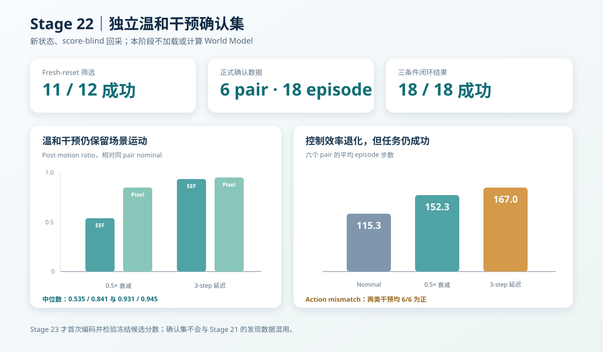

# WM 阶段 12：独立温和干预确认集回采

Stage 21 的预注册绝对 commanded-error 主指标没有通过，但事后诊断发现，故障 post 段的
`commanded error − executed error` 在 6/6 对上为正。为了避免在同一批数据上既发现又验证，
本阶段**不加载 DINOv2、不加载 WM、不计算任何候选分数**，只构建一批独立确认数据。

最终结果：**6 个全新 pair、18 条完整观测轨迹全部满足 Stage 23 的共同窗口要求；两类温和
干预均产生非零 action mismatch，同时 18/18 回合保持成功。**



## 独立候选与冻结规则

候选来自 Stage 18—19 的历史成功标签，但排除了 Stage 20 fresh-reset screen 中出现过的全部
12 个状态。选择只使用 task、init、历史 success/steps 和固定哈希，不读取任何 WM 分数。

预注册候选：

| Task | 固定顺序的 4 个候选 | Fresh-reset 结果 | 冻结状态 |
| ---: | --- | --- | --- |
| 4 | init 7、4、12、11 | 成功、失败、成功、成功 | init 7、12 |
| 7 | init 5、9、3、12 | 4/4 成功 | init 5、9 |
| 8 | init 11、26、18、13 | 4/4 成功 | init 11、26 |

每任务完整跑完四个候选，不因已出现两个成功而提前停止。冻结规则是在固定顺序中取前两个
fresh-reset 成功且至少运行 90 个控制步的状态，确保 H10 post 起点 50—79 的最后目标帧可用。
12 个候选共 11 成功、1 失败。

## 两类温和动作干预

每个冻结状态分别使用独立环境实例运行三种条件，干预都从零基 step 50 开始：

- `nominal`：执行当前 SmolVLA commanded action；
- `motion_attenuation_0p5`：机械臂前 6 维执行 `0.5 × commanded`，夹爪执行当前命令；
- `action_delay_3`：机械臂前 6 维执行 `t−3` 的 commanded action，夹爪执行当前命令。

每条归档保存同步双相机、完整 robot state、commanded/executed action、reward、success、done、
transition-valid mask 和 intervention mask。Stage 23 的候选分数在编码前已经冻结为：

```text
fault-post commanded H10 raw MSE − executed H10 raw MSE
```

方向预注册为正。本阶段没有查看这个分数。

## 闭环结果

| Pair | Nominal | 0.5× 衰减 | 3-step 延迟 |
| --- | ---: | ---: | ---: |
| Task 4 / init 7 | 成功，126 步 | 成功，178 步 | 成功，131 步 |
| Task 4 / init 12 | 成功，137 步 | 成功，183 步 | 成功，141 步 |
| Task 7 / init 5 | 成功，120 步 | 成功，164 步 | 成功，253 步 |
| Task 7 / init 9 | 成功，124 步 | 成功，172 步 | 成功，268 步 |
| Task 8 / init 11 | 成功，94 步 | 成功，110 步 | 成功，105 步 |
| Task 8 / init 26 | 成功，91 步 | 成功，107 步 | 成功，104 步 |
| **合计** | **6/6，692 步** | **6/6，914 步** | **6/6，1,002 步** |

两种干预没有像 Stage 20 的 persistent dropout 一样把任务直接变成必然失败，但都造成了控制代价：

- 0.5× 衰减平均从 115.3 步增加到 152.3 步，增加 37.0 步；
- 3-step 延迟平均增加到 167.0 步，增加 51.7 步；
- Task 7 对延迟最敏感，两个回合分别延长 133 和 144 步。

## 非静止性与 action mismatch

为了确认新数据没有重复 Stage 20 的“完全停机”混淆，在预注册 post transition 50—88 上只计算
与 WM 无关的 actuator/trajectory 诊断：

| 条件 | Action mismatch > 0 | EEF motion / nominal 中位数 | Pixel motion / nominal 中位数 |
| --- | ---: | ---: | ---: |
| 0.5× 衰减 | 6/6 | 0.535 | 0.841 |
| 3-step 延迟 | 6/6 | 0.931 | 0.945 |

0.5× 衰减降低了末端执行器运动幅度，但双相机像素运动仍保留 nominal 的 84.1%；3-step 延迟的
EEF 与像素运动分别保留 93.1% 和 94.5%。因此这批轨迹同时具备：

- commanded/executed action 明确不同；
- 场景仍持续运动；
- 最终任务结果仍成功；
- 控制效率出现可测退化。

它更适合检验 action-sensitivity，而不是把“失败”“画面静止”和“动作不一致”绑成同一个标签。

## 对齐、覆盖与可恢复性审计

六个 pair 全部满足：

- 三条件初始观测内容哈希一致；
- 干预前 50 步 commanded action 逐位一致；
- 干预前 51 帧双相机与完整状态逐位一致；
- nominal 步数、成功标签、初始观测和动作哈希精确复现 fresh-reset screen；
- 每条轨迹至少有 89 个有效 transition，可覆盖 H10 post 起点 50—79；
- 0.5× 与 3-step 两种实际 action 变换都通过逐位验证；
- 无覆盖 resume 重新读取 18 个 NPZ，并复核文件哈希、内容哈希和协议哈希。

数据规模：

| 项目 | 数量 |
| --- | ---: |
| Fresh-reset 筛选 | 12 episode |
| 正式确认集 | 6 pair / 18 episode |
| 正式控制步 | 2,608 |
| 原始压缩归档 | 732,269,351 bytes，约 698 MiB |
| 首次完整运行 | 约 859.4 秒 |
| 峰值 PyTorch GPU allocation | 约 927 MiB |

全部实验继续在 RTX 4060 Laptop GPU（8 GB）上完成。

## 公开产物与运行方式

公开结果位于
[`results/wm/stage22_confirmatory_interventions`](../results/wm/stage22_confirmatory_interventions)：

- `fresh_reset_screen.csv`：12 个从未进入 Stage 20 screen 的固定候选；
- `episodes.csv`：18 个正式归档的模态、步数、诊断和哈希 manifest；
- `pairs.csv`：六组三条件对齐、动作 mismatch 与非静止运动比例；
- `report.json`：冻结协议、数据规模、审计结论与 Stage 23 readiness。

原始 NPZ 只保存在 `outputs/wm/stage22_confirmatory_interventions`，不提交 Git。

```bash
HF_HUB_OFFLINE=1 TRANSFORMERS_OFFLINE=1 MUJOCO_GL=egl \
uv run --no-sync python scripts/wm/stage22_collect_confirmatory_interventions.py \
  --checkpoint-dir /path/to/stage2_checkpoint/checkpoint \
  --stage2-manifest /path/to/stage2_checkpoint/manifest.json \
  --backbone-dir /path/to/stage3_single_inference/backbone
```

## 结论边界与 Stage 23

本阶段只证明确认集**独立、对齐、存在 action mismatch 且没有完全静止**，不证明候选 WM 分数
有效。Stage 23 才会第一次对这 18 条轨迹编码，并按冻结方向做确认性检验。

即使 Stage 23 通过，结论也首先限于“有 executed-action feedback 时的合成执行器异常检测”；
它不能自动等价为自然 VLA 语义失败检测，也不能跳过独立阈值校准直接部署在线 shield。
