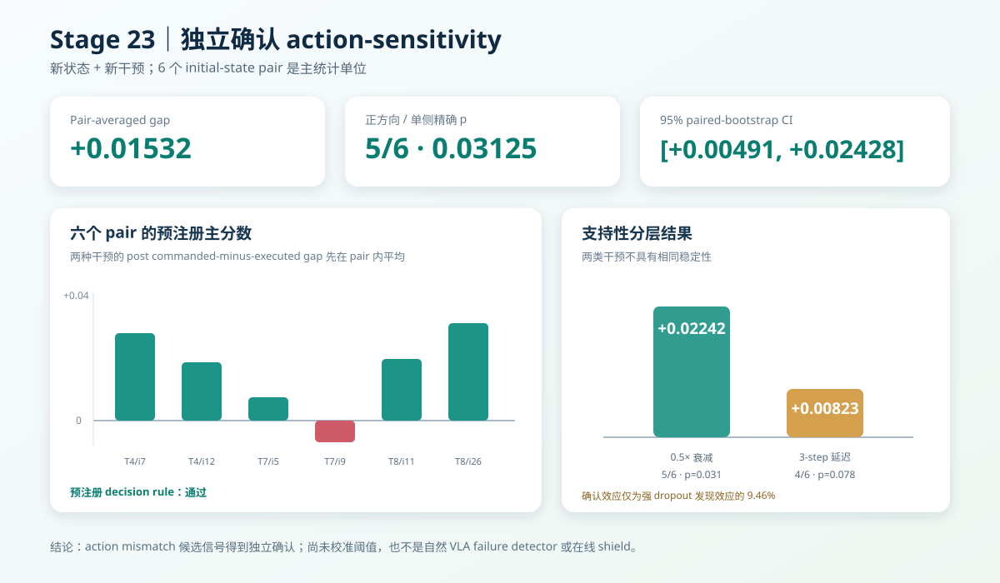

# WM 阶段 13：独立确认 action-sensitivity 分数

Stage 21 在强 persistent dropout 数据上发现，fault-post 的
`commanded H10 error − executed H10 error` 可能反映 action–consequence mismatch。Stage 22
随后在完全不同的初始状态上 score-blind 回采了 0.5× 动作衰减与 3-step 动作延迟轨迹。

本阶段第一次编码这批独立数据，并执行编码前冻结的确认性检验。结果为：

> 两种干预先在每个初始状态内平均后，候选分数均值为 **+0.01532**，5/6 pair 为正，
> 单侧精确符号翻转 `p=0.03125`，95% paired-bootstrap CI 为
> `[+0.00491, +0.02428]`。预注册 decision rule **通过**。



## 预注册确认协议

Stage 22 在查看任何确认集 WM 分数前已经冻结：

- 候选分数：fault-post `commanded_h10_raw_mse − executed_h10_raw_mse`；
- 方向：正；
- H10 post 起点：50—79；
- discovery episode：0 条复用。

Stage 23 在编码前进一步固定主统计：

1. 每个 fault episode 先对 30 个 post 窗口求均值；
2. 每个初始状态再平均 0.5× 衰减和 3-step 延迟两个分数；
3. 最终只把 6 个初始状态 pair 作为统计单位；
4. 主决策要求均值大于 0、至少 5/6 pair 为正、单侧精确符号翻转 `p≤0.05`。

1080 个重叠窗口没有被当成独立样本，两种干预也没有被错误地视为 12 个独立 pair。单侧检验是
因为方向已在 Stage 22 冻结；6 个 pair 对应 64 种完整符号分配，最小单侧 `p=1/64`。

## 冻结模型与数据隔离

- 视觉编码器：冻结 `facebook/dinov2-small` 指定 revision；
- dynamics：冻结 Stage 14 action-conditioned/no-action best checkpoint；
- normalization：只来自 Stage 13 train split；
- 更新模型参数：0；
- 拟合 detector 参数或 threshold：0；
- 专家 test episode：0；
- Stage 21 discovery 与 Stage 22 confirmation 初始状态无重叠。

每步递归仍使用对应轨迹的 oracle robot state，与 Stage 15、17、21 的模型评测约定一致。

## Pair 级主结果

| Pair | 0.5× 衰减 gap | 3-step 延迟 gap | Pair 内平均 | 主方向 |
| --- | ---: | ---: | ---: | --- |
| Task 4 / init 7 | +0.04018 | +0.01221 | +0.02620 | 是 |
| Task 4 / init 12 | +0.02763 | +0.00717 | +0.01740 | 是 |
| Task 7 / init 5 | +0.01551 | −0.00158 | +0.00696 | 是 |
| Task 7 / init 9 | −0.00678 | −0.00618 | −0.00648 | 否 |
| Task 8 / init 11 | +0.02124 | +0.01597 | +0.01861 | 是 |
| Task 8 / init 26 | +0.03673 | +0.02176 | +0.02925 | 是 |

| 主统计 | 结果 |
| --- | ---: |
| Pair mean | +0.01532 |
| Pair median | +0.01800 |
| 95% paired-bootstrap CI | [+0.00491, +0.02428] |
| Positive pairs | 5/6 |
| Paired effect `d_z` | 1.160 |
| 单侧精确符号翻转 `p` | 0.03125 |
| 预注册 decision rule | **通过** |

唯一整体反向的是 Task 7 / init 9。Task 7 / init 5 的延迟分数也略为负，但被同 pair 的衰减正值
抵消。因此确认通过不等于所有 task、state、intervention 都逐一同向。

## 两类干预的支持性结果

| 干预 | 均值 | 正方向 pair | 95% CI | 单侧精确 `p` |
| --- | ---: | ---: | --- | ---: |
| 0.5× 衰减 | +0.02242 | 5/6 | [+0.00936, +0.03378] | 0.03125 |
| 3-step 延迟 | +0.00823 | 4/6 | [+0.00057, +0.01581] | 0.078125 |

0.5× 衰减单独复现了方向和精确检验门槛；3-step 延迟平均值与 bootstrap CI 为正，但 pair 方向
只有 4/6，精确检验没有达到 0.05。两种干预差值的探索性双侧检验为 `p=0.0625`，提示衰减
信号更强，但不能据此宣称干预间存在已确认差异。

## 与 Stage 21 发现效应的量级对照

| 数据 | Action-sensitivity mean |
| --- | ---: |
| Stage 21：完全 motion dropout | +0.16191 |
| Stage 23：两类温和干预 | +0.01532 |
| Confirmation / discovery | 9.46% |

独立确认效应只有强故障发现效应的约十分之一。这种 shrinkage 是合理且必须报告的：Stage 20
直接把机械臂运动维度置零，而 Stage 22 的轨迹仍保留 84%—95% 像素运动且 18/18 成功。结果
支持冻结 WM 对“命令动作与实际执行动作的细微差异”具有可重复敏感性，但效应远小于 discovery
pilot，实际检测阈值可能很难校准。

## 负对照与确定性

- Nominal commanded/executed action 完全相同，对应 H10 分数逐位相同；
- 两类 fault 的 pre 段 commanded/executed 完全相同，对应 H10 分数逐位相同；
- 最短 episode 重新运行 DINOv2，与特征缓存 token 逐位相同；
- 18 个特征 shard 共 64,795,296 bytes，约 61.8 MiB；
- 冷启动编码、重算与评分约 31.8 秒，峰值 PyTorch GPU allocation 约 193 MiB；
- 从缓存再次独立评分后，五个核心 CSV/JSON 产物逐字节相同。

## 公开结果

公开产物位于
[`results/wm/stage23_confirmatory_wm_scoring`](../results/wm/stage23_confirmatory_wm_scoring)：

- `window_scores.csv`：18 × 60 个窗口的四类 H10 分数；
- `episode_period_scores.csv`：每条轨迹 pre/post 的 episode 聚合；
- `pair_confirmation.csv`：六个主统计单位、两种干预 gap 与 motion-normalized 诊断；
- `statistics.json`：主检验、支持性分层结果与干预差异探索；
- `feature_manifest.csv`：18 个本地特征 shard 的来源和哈希；
- `report.json`：冻结模型、确认协议、结论和限制。

原始特征仅保存在 `outputs/wm/stage23_confirmatory_wm_scoring`，不提交 Git。

```bash
HF_HUB_OFFLINE=1 TRANSFORMERS_OFFLINE=1 \
uv run --no-sync python scripts/wm/stage23_confirmatory_wm_scoring.py
```

## 能说明什么、不能说明什么

可以说明：

- Stage 21 发现的相对 action-sensitivity 方向在新状态、新干预上通过了一次预注册确认；
- 相对 commanded/executed error 比单独使用绝对 commanded error 更能隔离视觉运动难度；
- 冻结小型 latent dynamics 可以作为 actuator action mismatch 的候选监测信号。

不能说明：

- 18 条确认轨迹全部成功，因此没有验证自然 VLA policy failure detection；
- 当前结果依赖 executed-action feedback，不能假设所有真机都能获得同质量的实际动作；
- 没有独立 threshold calibration 数据，不能报告部署级 precision/recall、误报率或 detection delay；
- oracle state 递归评测尚未替换为完全在线可观测状态管线；
- 6 个 pair 仍不足以支持跨任务、跨机器人或真实故障的通用结论。

因此后续可以继续做 detector/时序 onset 分析与在线旁路接入，但必须继续区分“候选信号已确认”
和“在线 shield 已验证”；后者在本阶段仍不成立。
