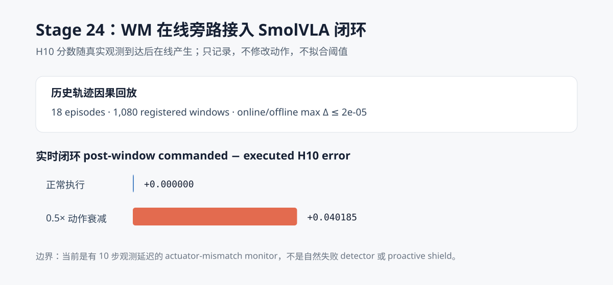
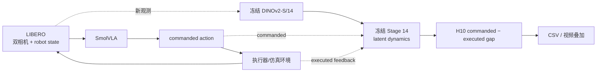

# WM 阶段 14：在线旁路接入 SmolVLA 闭环

Stage 23 已在独立温和执行器干预上确认
`commanded H10 error − executed H10 error` 的正方向，但当时的计算仍发生在轨迹采集结束之后。
本阶段把同一个冻结 DINOv2 编码器和 latent dynamics 真正放入 SmolVLA→LIBERO 控制循环：
每个新观测到达后更新 H10 分数，只记录日志和视频，不设置阈值，也不改变任何动作。

结果为：

> 在线监控器在 18 条历史轨迹的 1,080 个注册窗口上与 Stage 23 离线实现一致，最大分数差为
> **2.205×10⁻⁶**。真实闭环中，正常与 0.5× 动作衰减两个 90 步前缀的 commanded action、
> executed action 和 reward 均与原 Stage 22 轨迹**逐位一致**；正常 post gap 为
> **0.00000**，动作衰减为 **+0.04018**。



[正常执行监控视频](../media/wm_stage24_nominal_monitor.mp4) ·
[0.5× 动作衰减监控视频](../media/wm_stage24_motion_attenuation_0p5_monitor.mp4)

## 接入结构



虚线支路是新增的 sidecar。它不位于动作执行必经路径上，输出也没有回连策略或环境，因此本阶段
不存在动作拦截、缩放或恢复逻辑。

## 因果在线语义

`OnlineWorldModelMonitor` 的调用顺序是：

1. reset 时编码初始观测 `o₀` 和状态 `s₀`；
2. SmolVLA 产生 commanded action，环境接收 executed action；
3. 下一帧真实观测到达后编码 latent，并向 monitor 提交这条 transition；
4. 缓冲区满 10 条 transition 后，输出一个闭合的 H10 窗口分数；
5. 之后每来一帧就滑动一次，并输出一个新分数。

起点为 `t` 的分数使用状态 `s_t…s_{t+9}`、动作 `a_t…a_{t+9}` 和目标观测 `o_{t+10}`，
因此只能在执行完 action `t+9`、看到 `o_{t+10}` 后产生。它没有提前读取尚未到达的未来帧。

这不等于“故障发生后一定等 10 步才有任何响应”：持续滚动的旧窗口可能在第一个故障 transition
完成后就包含部分故障信息。但若要把某个分数完整归因于故障后的 10 条 transition，则仍需等到
相应窗口闭合。本阶段没有选择阈值，所以也没有报告 detection latency。

## 两级一致性验证

### 1. 在线评分器与 Stage 23 批量评分

使用 Stage 23 已缓存、未重新编码的 visual token，按真实到达顺序逐帧送入在线 monitor。

| 核对项 | 结果 |
| --- | ---: |
| Episode | 18 |
| 注册 H10 窗口 | 1,080 |
| 最大绝对分数差 | 2.205×10⁻⁶ |
| 通过容差 | 2×10⁻⁵ |
| 单窗口 WM 评分均值 | 约 15.8 ms |

微小差异来自单窗口和批量矩阵计算顺序不同，不改变任何 Stage 23 结论。

### 2. 在线 DINO 编码与 Stage 23 特征缓存

对同一轨迹的 observation 0、50、89，在线按一帧双相机编码，并与 Stage 23 的 batch 编码结果
比较：

| 核对项 | 结果 |
| --- | ---: |
| Robot state 最大差 | 0 |
| FP16 token 最大差 | 0.001953125 |
| 在线编码均值（3 帧冷/热混合） | 约 35.9 ms |

token 差异来自不同 DINO batch shape 下的 GPU/FP16 数值顺序。进一步在真实闭环的 60 个注册
窗口上核对后，最终 H10 error 最大差仅约 `1.36×10⁻⁵`。

## 真实 SmolVLA/LIBERO 接入结果

选择 Stage 22 的 Task 4 / init 7，在全新的环境实例里分别运行 normal 和 0.5× 动作衰减。
两条诊断轨迹都固定为 90 个控制步，正好覆盖 pre 起点 10—39 和 post 起点 50—79；它们不是
完整任务成功率评测。

| 条件 | 90 步控制输出复现 | Pre gap | Post gap | 在线编码/观测 | WM 评分/窗口 |
| --- | --- | ---: | ---: | ---: | ---: |
| Normal | action、reward 逐位一致 | 0.00000 | 0.00000 | 14.1 ms | 15.3 ms |
| 0.5× 衰减 | action、reward 逐位一致 | 0.00000 | +0.04018 | 13.9 ms | 14.8 ms |

两条轨迹中的 monitor 输出没有参与动作生成。整次进程峰值 PyTorch GPU allocation 约
**1.07 GB**，包含 SmolVLA、DINOv2 和两个轻量 dynamics；配对在线部分总墙钟约 48.9 秒。
这些是组件延迟测量，不是与无 WM 基线严格配对的吞吐下降比例。

## 公开产物

公开结果位于
[`results/wm/stage24_online_sidecar`](../results/wm/stage24_online_sidecar)：

- `replay_comparison.csv`：1,080 个在线/离线注册窗口的逐项绝对差；
- `live_timeline.csv`：两条真实闭环从 start 0—80 的在线分数与产生时刻；
- `live_summary.json`：逐条件时序聚合、控制输出核对和媒体哈希；
- `report.json`：冻结组件、因果语义、运行时、结论与边界。

本地轨迹只保存在 `.gitignore` 排除的 `outputs/wm/stage24_online_sidecar`。两段 90 步监控视频较小，
直接提交到 `media/`，画面左上角显示当前 observation index 和最近一次 H10 gap。

```bash
HF_HUB_OFFLINE=1 TRANSFORMERS_OFFLINE=1 TOKENIZERS_PARALLELISM=false \
MUJOCO_GL=egl uv run --no-sync python \
  scripts/wm/stage24_online_sidecar.py
```

## 结论边界与下一步

本阶段可以说明：

- 冻结 WM 已在真实 SmolVLA/LIBERO 控制循环内随观测在线运行；
- 旁路接入不会改变当前两条配对控制轨迹；
- 在线计算复现了 Stage 23 的离线 action-mismatch 分数；
- 在 RTX 4060 Laptop GPU 上，SmolVLA、DINO 与 WM 可以同时驻留并完成闭环监测。

本阶段仍不能说明：

- 没有阈值，因此还不是输出 alarm 的 detector；
- 没有独立 calibration/test 检测集，不能报告误报率、召回率或 detection latency；
- 没有任何动作干预或恢复策略，因此不是 online shield；
- 信号针对 commanded/executed mismatch，不能自动外推到 SmolVLA 的语义决策错误；
- 当前只做了一个初始状态的在线工程验证，不能替代跨任务统计评测。

Stage 25 应采集与 Stage 23 分离的新 calibration/test episode：只用 calibration 集冻结 threshold，
随后在 test 集报告 event-level 检出率、正常误报率和 onset latency。完成这一步以后，才能决定
是否值得把 detector 接到暂停、动作缩放或 recovery policy。
