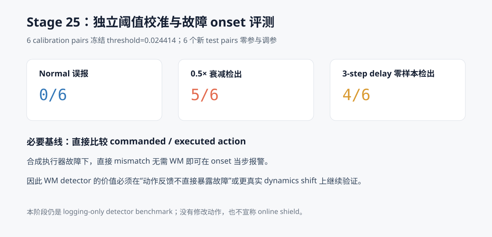

# WM 阶段 15：独立 detector 校准与故障 onset 评测

Stage 24 已把冻结 WM 作为 sidecar 接入 SmolVLA/LIBERO，但当时只有连续分数，没有报警规则。
本阶段严格分离 calibration 与 test：先在 6 个新初始状态上冻结一个 threshold，再采集和评测
另外 6 个完全留出的状态。Test 还加入 calibration 从未出现的 3-step action delay，用于检验
跨故障类型泛化。

主要结果：

> Calibration-only threshold 为 **0.024414**，报警要求连续 3 个 H10 窗口超过阈值。
> 在 6 个留出 test pair 上，正常误报为 **0/6**，0.5× 动作衰减检出 **5/6**，
> 零样本 3-step delay 检出 **4/6**。仅对检出的 episode 统计，平均 onset latency
> 分别为 **12.8** 和 **10.0** 个控制步。

但必要基线给出了更重要的边界：

> 直接计算 `||commanded action − executed action||₂` 对两类合成故障均为 **6/6** 检出、
> **0 步延迟**，正常误报 **0/6**。因此在当前故障定义下，WM detector 不如直接动作比较，
> 不能据此继续宣称或构建 online shield。



## 数据隔离与冻结顺序

Stage 25 排除了 Stage 20 和 Stage 22 曾 fresh-reset 筛选的**全部**状态，而不只是最终入选状态。
候选只来自未查看 WM 分数的 Stage 18/19 score-blind scout，并要求历史轨迹至少覆盖 90 步。

固定哈希排序后，每任务前 2 个状态进入 calibration、后 2 个进入 test：

| Task | Calibration init | Test init |
| ---: | --- | --- |
| 4 | 3, 13 | 6, 9 |
| 7 | 10, 13 | 8, 11 |
| 8 | 16, 5 | 10, 23 |

两组各 6 个 pair，彼此无重叠，也与 Stage 20/22/23 干预状态无重叠。历史 nominal 是否完成任务
不参与选择：本阶段标签是“执行器故障是否开启”，不是“任务是否成功”，而所有状态都能覆盖注册
时序窗口。

实际执行顺序为：

1. 写入包含 12 个状态、全部条件和阈值算法的 `protocol.json`；
2. 只采集 6 个 calibration pair 的 normal 与 0.5× 衰减，共 12 条轨迹；
3. 验证每组轨迹在故障前 50 步的 commanded action 和 reward 逐位一致；
4. 由 calibration 分数生成 `outputs/.../frozen_threshold.json`；
5. threshold 文件落盘后，才开始采集 6 个 test pair 的 18 条轨迹；
6. 固定 threshold 一次性计算 test 事件指标。

因此 test score 没有参与 threshold、连续窗口数或方向的选择。

## Detector 定义

连续分数保持 Stage 23/24 的定义：

```text
score_t =
    commanded-conditioned H10 raw latent MSE
  − executed-conditioned H10 raw latent MSE
```

报警规则固定为：

```text
连续 3 个窗口满足 score > 0.024414 → alarm
```

阈值候选来自 calibration 衰减 episode 的 full-post 起点 50—79：把所有正分数去重排序，并取
相邻值及 0 之间的中点。最终选择满足下列条件的最大阈值：

- 6 条 calibration normal 上事件误报为 0；
- 6 条 calibration fault 的严格 pre 区间误报为 0；
- 至少检出 5/6 条 calibration attenuation。

共评估 102 个候选阈值，最终 calibration 恰好检出 5/6。使用最大合格阈值是预先冻结的保守规则，
不是看到 test 结果后的选择。

## Onset 时序语义

故障从 action step 50 开始。H10 rolling window 的：

- 严格 pre 起点为 0—40，最后一个窗口只包含 action 40—49；
- fault-influenced 起点为 41—80，其中 start 41 的最后一个 transition 已包含 action 50；
- 起点 `s` 的分数在执行完 action `s+9` 后产生；
- 需要连续 3 个正窗口，因此理论最早报警时刻是 step 52，对应 2 步 latency。

这里的 latency 定义为：

```text
首次满足连续窗口规则的 available_after_step − 50
```

漏检 episode 不被伪造为最大 latency；平均数只对已检出的 episode 计算，并同时报告检出分母。

## Calibration 结果

| 条件 | Episode | WM 事件结果 | 平均 latency | Pre 误报 |
| --- | ---: | ---: | ---: | ---: |
| Normal | 6 | 0/6 误报 | — | — |
| 0.5× 衰减 | 6 | 5/6 检出 | 11.4 steps | 0/6 |

阈值规则本来就要求 calibration 至少 5/6 检出，因此 calibration 指标不能当成独立效果；它只说明
冻结过程满足协议。

## 留出 Test 结果

| Test 条件 | WM 检出/误报 | 比例 | 95% Wilson CI | 检出后的 latency |
| --- | ---: | ---: | --- | ---: |
| Normal | 0/6 误报 | 0% | [0.0%, 39.0%] | — |
| 0.5× 衰减 | 5/6 检出 | 83.3% | [43.6%, 97.0%] | mean 12.8，median 15 |
| 3-step delay（零样本） | 4/6 检出 | 66.7% | [30.0%, 90.3%] | mean 10.0，median 10.5 |

逐任务漏检：

- 衰减：Task 7 / init 11；
- delay：Task 7 / init 8、Task 7 / init 11；
- Task 4 与 Task 8 的两类故障均检出。

样本量只有 6，因此置信区间很宽。正常 `0/6` 也不能解释成部署级“零误报”；Wilson 上界仍为
39.0%。

## 必要基线揭示的限制

| Test 条件 | WM detector | 直接 action mismatch | WM latency | 直接 latency |
| --- | ---: | ---: | ---: | ---: |
| Normal | 0/6 误报 | 0/6 误报 | — | — |
| 0.5× 衰减 | 5/6 | 6/6 | mean 12.8 | 0 |
| 3-step delay | 4/6 | 6/6 | mean 10.0 | 0 |

两种干预都是在脚本里把 commanded action 改写成不同的 executed action，因而故障标签已经直接
暴露在 action feedback 中。此时使用 WM 做检测没有实际必要，直接比较动作更准确、更快，也更
容易解释。

这个结果不是基础设施失败，而是一次重要的实验设计否证：

- Stage 23 证明 WM 对 action–consequence mismatch 有可重复敏感性；
- Stage 24 证明它可以在线接入；
- Stage 25 证明在“executed action 已直接暴露故障”的设定中，这种敏感性没有转化成优于简单
  baseline 的 detector 价值。

因此不应跳过这个基线，直接把 WM 分数接到动作拦截并称为 shield。

## 规模、资源与公开产物

- 12 个 pair，30 条 90-step 在线轨迹；
- 2,700 条控制 transition、2,430 个 rolling H10 score；
- 首次完整采集和评测约 709.3 秒；
- 峰值 PyTorch GPU allocation 约 1.07 GB；
- 所有 12 个 pair 的故障前 action/reward 配对检查通过。

公开结果位于
[`results/wm/stage25_detector_calibration`](../results/wm/stage25_detector_calibration)：

- `protocol.json`：选择、划分、条件和冻结算法；
- `pairs.csv`：12 个 pair 及故障前配对审计；
- `episodes.csv`：30 条轨迹的来源、哈希和运行摘要；
- `window_scores.csv`：2,430 个在线窗口；
- `frozen_threshold.json`：在 test 前落盘的唯一 detector 参数；
- `detector_events.csv`：事件级 alarm、latency 和直接基线；
- `report.json`：校准、留出测试、限制和下一阶段 gate。

原始轻量轨迹与逐 episode resume metadata 保存在 `.gitignore` 排除的
`outputs/wm/stage25_detector_calibration`。

```bash
HF_HUB_OFFLINE=1 TRANSFORMERS_OFFLINE=1 TOKENIZERS_PARALLELISM=false \
MUJOCO_GL=egl uv run --no-sync python \
  scripts/wm/stage25_detector_calibration.py
```

## 下一阶段 gate

按照原路线，detector 之后本来可以尝试 recovery/shield。但 Stage 25 的基线对照表明，现在直接
做 shield 会把一个更慢、更弱的 WM detector 强行放进控制路径，没有研究价值。

更合理的 Stage 26 是构造“不由 action log 直接泄露标签”的 dynamics shift，例如改变动力学、
接触、摩擦、负载或部分观测可靠性，使 commanded/executed action 在日志层仍一致，再研究：

- task-conditioned / state-conditioned residual calibration；
- action-conditioned prediction residual，而不是 commanded/executed 两路差值；
- 相对 persistence/no-action baseline 的残差；
- 在这种隐藏故障上与 state/action heuristic 做公平比较。

只有 WM 在这类设定中提供了直接 heuristic 没有的信息，才值得进入 recovery policy 和闭环
shield 对照。
