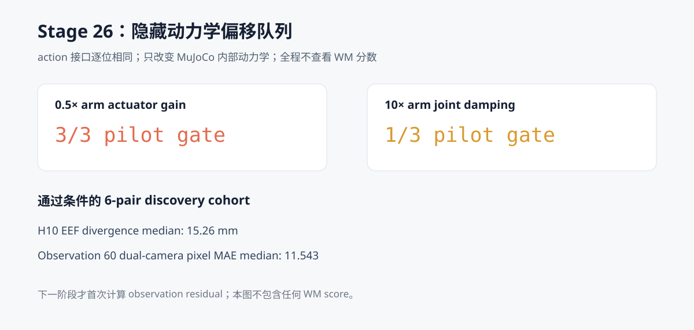

# WM 阶段 16：Score-blind 隐藏动力学偏移队列

Stage 25 的 WM detector 在留出集上能够检测动作衰减和动作延迟，但这两种故障都会让
`commanded action` 与实际传给环境的 `executed action` 直接不同。简单的 action mismatch
因此取得 6/6 检出和 0 步延迟，说明继续在同一标签上做 WM shield 没有研究价值。

本阶段把故障移入 MuJoCo 内部：动作通过策略—环境接口时保持不变，只在 step 50 修改机械臂
动力学参数。采集过程中不加载 DINOv2、latent WM 或 Stage 25 detector，也不计算任何 WM
分数。目标不是证明 detector 已经成功，而是得到一组不会由 action log 直接泄露标签、可供
下一阶段公平研究 observation residual 的严格配对数据。

主要结果：

> 3-pair pilot 中，**0.5× arm actuator gain 为 3/3 通过**，10× joint damping 只有
> **1/3 通过**，因此门控冻结后只让前者进入 6-pair discovery cohort。正式 6 对数据全部
> 通过配对与物理/视觉效果检查：H10 末端位置最大分叉中位数为 **15.26 mm**，第 60 个观测
> 的双相机像素 MAE 中位数为 **11.543**。15 条轨迹共 **0 个 action-interface mismatch**，
> WM 加载次数和评分数均为 **0**。



## 为什么这是“隐藏”故障

Stage 25 的动作衰减发生在 Python 控制接口：

```text
commanded action != action passed to env.step
```

Stage 26 则保持：

```text
commanded action == action passed to env.step
```

故障条件只在 MuJoCo 模型内部执行一次参数变更：

```text
step 50:
    actuator_gainprm[robot0_torq_j1..j7, 0] *= 0.5
```

因此，直接比较接口两端动作永远得到零 mismatch。故障影响要通过之后的机器人状态和相机观测
才能看见。这里的“隐藏”仅指**不由 action log 直接暴露**；仿真注入器当然知道参数何时被改动，
它仍是合成故障而不是真机自然故障。

## 数据选择与 score-blind 顺序

本阶段复用 Stage 25 的 6 个 calibration 状态作为 discovery 数据。它们此前只用于另一种动作
故障，不曾用于选择本阶段动力学条件；本阶段也完全不查看 WM 分数。

| Task | Pilot init | Gate 冻结后补采 init |
| ---: | ---: | ---: |
| 4 | 3 | 13 |
| 7 | 10 | 13 |
| 8 | 16 | 5 |

执行顺序固定为：

1. 写入包含候选动力学偏移、状态和门槛的 `protocol.json`；
2. 每个任务只取第一个状态，分别采 nominal、0.5× gain、10× damping，共 9 条 pilot；
3. 不计算 WM 分数，只核对配对一致性和动力学偏移是否产生足够状态/视觉分叉；
4. 将通过结果写入本地 `frozen_gate.json`；
5. 只对通过的条件补采每任务第二个状态；
6. 汇总 6 对 discovery 数据并公开哈希、逐对诊断和限制。

因此，Stage 27 可以在这 6 对上发现或选择 observation residual，但不能把同一批数据同时包装成
独立 test。Stage 25 的 6 个 test 状态继续保留，可在 detector 定义冻结后用于确认。

## Pilot 门控

每个候选条件要在 3 个 pilot pair 中至少 2 对同时满足：

- 初始观测、step 50 前观测和 step 50 前 policy command 逐位一致；
- step 50—59 的 H10 command 逐位一致；
- 每一步 `commanded action == action passed to env.step`；
- MuJoCo 参数变更经过变更前后快照验证；
- step 50 后前 H10 的 EEF 最大分叉至少 1 mm；
- observation 60 的双相机像素 MAE 至少 0.25。

结果如下：

| 候选动力学偏移 | Pilot 通过 | 跨 pair 最大 EEF 分叉 | 像素 MAE 中位数 | 决策 |
| --- | ---: | ---: | ---: | --- |
| 0.5× arm actuator gain | 3/3 | 51.66 mm | 12.024 | 进入 discovery |
| 10× arm joint damping | 1/3 | 1.45 mm | 2.465 | 拒绝 |

10× damping 的视觉差异并非完全为零，但 Task 7 和 Task 8 的 EEF 分叉没有达到预注册的 1 mm
状态门槛。门槛冻结后没有为了保留第二种故障而降低标准。

## 正式 discovery cohort

通过条件在 6 个状态上的逐对结果：

| Task / init | H10 EEF 最大分叉 | Observation 60 双相机像素 MAE | Pair gate |
| --- | ---: | ---: | --- |
| 4 / 3 | 10.89 mm | 12.024 | 通过 |
| 4 / 13 | 7.52 mm | 9.100 | 通过 |
| 7 / 10 | 51.66 mm | 11.063 | 通过 |
| 7 / 13 | 51.03 mm | 9.993 | 通过 |
| 8 / 16 | 9.57 mm | 12.981 | 通过 |
| 8 / 5 | 19.63 mm | 14.747 | 通过 |
| **中位数** | **15.26 mm** | **11.543** | **6/6** |

H10 command 仍然逐位一致，是因为 step 48 生成的动作块覆盖了 step 50—59；这使最早一段
物理后果比较不受策略重新规划混淆。之后策略会根据已经分叉的观测重新规划，command 序列允许
自然分开，但每条轨迹内部的 command 与环境接口动作仍始终逐位相同。

## 规模、资源与公开产物

- 3 个任务、6 个 discovery pair；
- pilot 9 条轨迹，门控后补采 6 条，共 15 条 90-step 轨迹；
- 1,350 条控制 transition；
- 首次完整运行约 378.8 秒；
- 峰值 PyTorch GPU allocation 约 0.97 GB；
- 本地压缩原始轨迹约 347 MiB。

公开结果位于
[`results/wm/stage26_hidden_dynamics_cohort`](../results/wm/stage26_hidden_dynamics_cohort)：

- `protocol.json`：状态、候选偏移、时序和预注册门槛；
- `frozen_gate.json`：pilot 后冻结的唯一准入结果；
- `episodes.csv`：15 条轨迹的哈希和运行摘要；
- `pilot_diagnostics.csv`：两种候选条件的 6 条 pilot 配对诊断；
- `paired_diagnostics.csv`：通过条件的 6 对正式诊断；
- `report.json`：汇总指标、负对照、运行资源和下一阶段 gate。

原始双相机/state/action `.npz` 与逐 episode metadata 保存在 `.gitignore` 排除的
`outputs/wm/stage26_hidden_dynamics_cohort`。

```bash
HF_HUB_OFFLINE=1 TRANSFORMERS_OFFLINE=1 TOKENIZERS_PARALLELISM=false \
MUJOCO_GL=egl uv run --no-sync python \
  scripts/wm/stage26_hidden_dynamics_cohort.py
```

## 结论边界与下一阶段

本阶段完成的是**合格的隐藏动力学 discovery 数据集**，不是一个新 detector，更不是在线
shield。当前结果只支持：

- 动作日志不再直接泄露故障标签；
- 配对前缀和最早 H10 command 满足严格负对照；
- 0.5× gain 在三个任务、六个状态上产生了稳定的状态与视觉后果。

下一阶段才首次在这批数据上计算 frozen WM 的 observation prediction residual，并与不需要 WM
的简单基线公平比较，例如 EEF/state innovation、像素帧差和 persistence residual。只有先在
discovery 上冻结 detector 规则，再在未参与选择的状态上保持低误报并优于简单基线，才有理由
进入在线 recovery/shield 对照。
