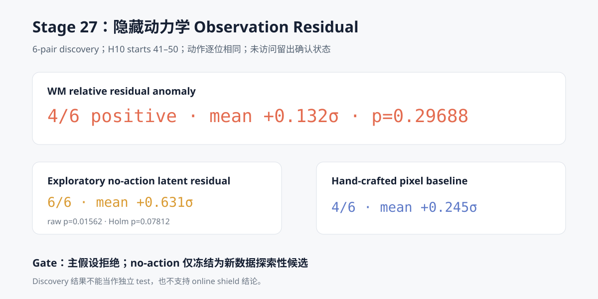

# WM 阶段 17：隐藏动力学 Observation Residual 探索

Stage 26 构建了 6 对 action 接口逐位相同的 nominal / 0.5× arm actuator gain 轨迹。本阶段首次
让冻结 DINOv2 和 Stage 14 latent dynamics 查看这批 discovery 数据，目标是回答：

> 当动作日志不再直接泄露故障时，action-conditioned WM 是否能比 no-action dynamics、
> latent persistence、EEF 运动和像素运动更稳定地发现观测后果？

预注册主结果没有通过：

> `action-conditioned H10 error − no-action H10 error` 的在线异常增量只有 **4/6 同向**，
> 均值 **+0.132σ**，单侧精确 sign-flip **p=0.296875**。它被 no-action residual 明确支配，
> 因此不能进入独立确认，更不能据此构建 detector 或 shield。

探索性比较产生了一个新假设：

> 冻结 no-action latent predictor 的绝对 residual 为 **6/6 同向**，均值 **+0.631σ**，
> 原始 `p=0.015625`、95% episode-pair bootstrap CI `[+0.282σ, +0.980σ]`。
> 但它来自 5 个辅助指标中的事后最优选择，Holm 校正后 **p=0.078125**，不能当作已确认结果。



## 因果窗口与负对照

故障在 action step 50 开始，H10 窗口定义为：

- pre calibration：start 10—40，共 31 个窗口；
- fault-influenced：start 41—50，共 10 个窗口；
- start 41 的 target 是 observation 51，第一次包含 action 50 的物理后果；
- start 50 的 target 是 observation 60，是唯一完全位于故障后的 H10 窗口。

Stage 26 的 SmolVLA 在 step 48 生成覆盖 step 48—59 的动作块，因此 nominal/fault 在全部
start 41—50 窗口内使用逐位相同的 policy command。12 条轨迹中：

- action-interface mismatch 总数为 0；
- 所有 pre 窗口的六类 raw metric 在 pair 内逐位相同；
- 所有 influenced H10 的 policy command 在 pair 内逐位相同；
- Stage 25 的 6 个留出 test 状态没有被读取。

这意味着本阶段的早期差异来自同一动作下的观测动力学分叉，而不是策略看到不同观测后重新规划
出的不同 command。

## 在线标准化

六类 raw metric 都使用完全相同、标签无关的 episode 内标准化：

```text
center = mean(raw score at starts 10..40)
scale  = sample std(raw score at starts 10..40)
floor  = max(abs(center) × 1e-6, 1e-8)

anomaly_t = abs(raw_t − center) / max(scale, floor)
```

配对效应以初始状态 pair 为统计单位：

```text
mean anomaly(fault, starts 41..50)
− mean anomaly(nominal, starts 41..50)
```

31 个重叠 pre 窗口和 10 个重叠 influenced 窗口不会被伪装成独立样本；每个 pair 最终只贡献
一个效应值，精确检验只有 `2^6 = 64` 个符号翻转。

## 指标定义

| 指标 | 定义 | 类型 |
| --- | --- | --- |
| WM relative residual | action-conditioned error − no-action error | 预注册主指标 |
| WM action residual | action-conditioned H10 raw latent MSE | 辅助 WM 指标 |
| No-action residual | no-action H10 raw latent MSE | 学习到的 dynamics 消融 |
| Latent persistence | start/target DINO latent MSE | 无预测模型视觉基线 |
| EEF path length | H10 内末端路径长度 | 手工 state 基线 |
| Pixel endpoint MAE | start/target 双相机像素 MAE | 手工 pixel 基线 |

No-action residual 仍然使用训练得到的 token dynamics、冻结 DINO 表征和每步 oracle robot state；
它不是手工启发式，只是不接收动作。EEF、像素和 persistence 才是不需要 dynamics checkpoint
的直接基线。

## 配对结果

| 指标 | 同向 pair | 均值效应 | 95% bootstrap CI | 原始 p | 辅助族 Holm p |
| --- | ---: | ---: | --- | ---: | ---: |
| **WM relative residual（主）** | **4/6** | **+0.132σ** | `[-0.103, +0.458]` | **0.296875** | 不适用 |
| WM action residual | 4/6 | +0.509σ | `[+0.048, +0.962]` | 0.078125 | 0.312500 |
| **No-action residual** | **6/6** | **+0.631σ** | `[+0.282, +0.980]` | **0.015625** | **0.078125** |
| Latent persistence | 4/6 | +0.187σ | `[-0.317, +0.570]` | 0.281250 | 0.500000 |
| EEF path length | 4/6 | +0.092σ | `[-0.076, +0.288]` | 0.250000 | 0.500000 |
| Pixel endpoint MAE | 4/6 | +0.245σ | `[-0.303, +0.750]` | 0.156250 | 0.468750 |

主指标的门槛固定为：均值大于 0、至少 5/6 pair 同向、单侧精确 `p≤0.05`。实际只满足第一项，
所以主假设明确拒绝。No-action residual 满足同样的未校正 pair gate，但辅助指标族的 Holm
校正没有通过 0.05；它只能成为下一批新数据的探索性候选。

## 为什么 action-conditioned 主信号失败

结果并不是“WM 完全看不见故障”：

- action-conditioned absolute residual 平均上升 +0.509σ；
- no-action residual 在 6/6 pair 上都上升；
- 手工 EEF/像素基线没有形成一致方向。

失败发生在两种 learned residual 的相减。隐藏增益变化带来的视觉异常同时提高了
action-conditioned 与 no-action error，而差分抵消了大部分共同异常。Stage 14 中动作条件相对
no-action 的一步验证优势本来只有 0.697%，不足以保证这个很小的模型差异在新闭环动力学上成为
稳定 detector。

另外，递归预测每一步都接收真实 robot state。状态分叉会帮助两种模型持续修正上下文，这可能
进一步减弱“动作条件优势崩塌”，也是后续需要做 state-context 消融的原因。

## 规模、确定性与公开产物

- 6 个 pair、12 条轨迹；
- 每条 41 个 H10 窗口，共 492 条 window row；
- 12 个冻结 DINO feature shard，本地约 26 MiB；
- 未缓存运行约 17.5 秒，峰值 PyTorch GPU allocation 约 0.20 GB；
- encoder、dynamics 和 detector 更新参数数均为 0。

同一进程内重复编码的 token bit-exact。额外的全新进程复跑中，12/12 shard 的 tensor payload
也逐张量 bit-exact；safetensors 容器二进制哈希会因 header 序列化顺序不同而变化，因此公开
manifest 记录的是本次冻结文件哈希，不把“容器字节完全一致”扩大成确定性结论。

公开结果位于
[`results/wm/stage27_hidden_dynamics_residual`](../results/wm/stage27_hidden_dynamics_residual)：

- `protocol.json`：在首次编码前冻结的窗口、主指标和门槛；
- `feature_manifest.csv`：12 个本地 feature shard 的来源与哈希；
- `online_calibration.csv`：每条 episode、每个指标的 pre center/scale；
- `window_scores.csv`：492 个窗口的 raw 与标准化 anomaly；
- `pair_effects.csv`：6 个统计单位的全部效应；
- `statistics.json`：精确检验、bootstrap、Holm 校正和 gate；
- `report.json`：结论、负对照、限制和下一阶段边界。

```bash
HF_HUB_OFFLINE=1 TRANSFORMERS_OFFLINE=1 TOKENIZERS_PARALLELISM=false \
uv run --no-sync python \
  scripts/wm/stage27_hidden_dynamics_residual.py
```

## 下一阶段边界

本阶段没有拟合 detector threshold，也没有访问独立 test，更没有动作拦截。合理的下一步不是
硬把失败的 relative residual 接入控制，而是：

1. 在查看任何新轨迹前，把探索性 `no_action_residual` 的模型、H10 窗口、pre 标准化和唯一
   decision rule 写入新的冻结协议；
2. 使用 Stage 25 保留的 6 个 test 状态重新采 nominal / 0.5× hidden gain；
3. 只检验这个冻结候选，同时继续报告 EEF、像素和 persistence，不再选择最佳指标；
4. 若独立确认失败，停止该 detector 路线并转向更强的 action/state-conditioned dynamics；
5. 只有独立确认、阈值校准和在线低误报都成立后，才讨论 recovery 或 shield。

因此当前最准确的结论是：**预注册 action-relative WM residual 失败；no-action latent residual
产生了值得新数据验证、但尚未通过多重比较确认的探索性信号。**
