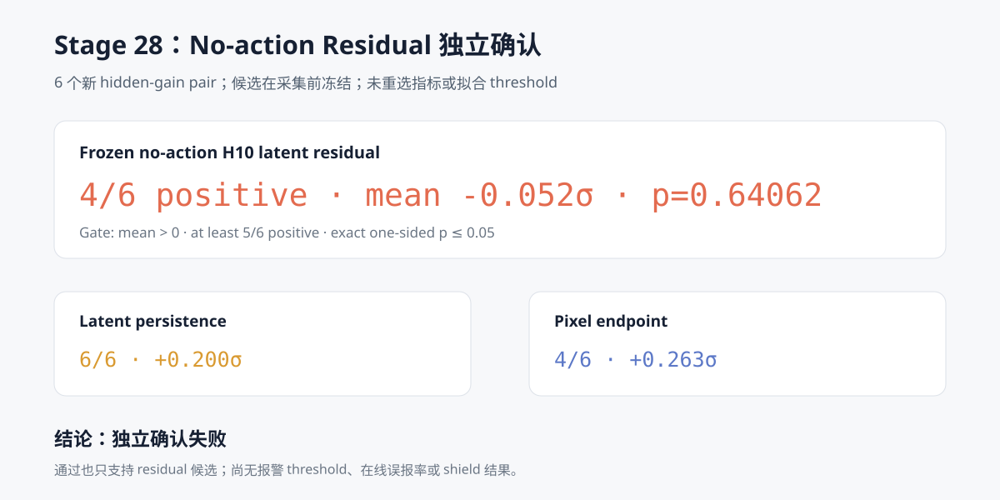

# WM 阶段 18：No-action Residual 隐藏动力学独立确认

Stage 27 在 6 对 hidden-gain discovery 数据上拒绝了预注册的 action-relative residual，但
事后发现 no-action latent residual 为 6/6 同向、原始 `p=0.015625`。由于它是 5 个辅助指标
中的最优者且 Holm `p=0.078125`，只能作为新假设。本阶段在生成任何新轨迹前冻结该候选、窗口、
标准化和唯一 decision rule，再使用 6 个未参与 Stage 26/27 hidden-dynamics 实验的状态做一次
独立确认。

确认失败：

> 冻结 no-action H10 residual 在新 6 对上只有 **4/6 同向**，标准化配对效应均值
> **−0.052σ**，95% bootstrap CI `[-0.290σ, +0.158σ]`，单侧精确 sign-flip
> **p=0.640625**。它没有满足均值大于 0、至少 5/6 同向和 `p≤0.05` 中的任何完整组合，
> 因此停止当前 detector 候选，不进入 threshold、事件级报警或 shield。



## 冻结顺序

脚本实际执行顺序为：

1. 读取 Stage 27 公开 report，确认预注册主指标失败且探索性候选为 `no_action_residual`；
2. 固定 6 个确认状态、候选模型、H10 窗口、pre 标准化和 pair-level decision rule；
3. 将 `frozen_candidate.json` 与 `protocol.json` 写入本地输出目录；
4. 打印候选已冻结后，才加载 SmolVLA；
5. 采集 6 对 nominal / 0.5× hidden gain 新轨迹；
6. 验证所有配对契约后，才加载 DINOv2 和冻结 no-action dynamics；
7. 一次性计算唯一确认指标与固定描述性对照。

`frozen_candidate.json` 明确保留：

- 候选来自 Stage 27 事后探索，而不是 Stage 27 预注册成功；
- Stage 27 诊断族 Holm `p=0.078125`，没有通过 0.05；
- 新确认分数在冻结时尚未生成或查看；
- detector threshold 为 `null`。

## 确认状态

确认集来自 Stage 25 固定 test split：

| Task | Init states |
| ---: | --- |
| 4 | 6, 9 |
| 7 | 8, 11 |
| 8 | 10, 23 |

它们与 Stage 26/27 discovery 状态 `{4: 3/13, 7: 10/13, 8: 16/5}` 完全不重叠。需要保留的
限制是：这些状态曾在 Stage 25 上用于另一种“动作日志直接可见”的故障测试，因此不是从未出现在
项目中的状态；但本阶段的 nominal / hidden-gain 轨迹是候选冻结后首次生成，之前从未计算过
hidden-dynamics no-action residual。

## 配对契约

12 条 90-step 轨迹全部通过：

- nominal/fault 初始观测逐位相同；
- step 50 前观测与 policy command 逐位相同；
- step 50—59 的第一段 post-H10 command 逐位相同；
- 每条轨迹的 commanded action 与传给 `env.step` 的 action 始终逐位相同；
- 0.5× actuator gain 的 MuJoCo 参数快照变更验证成功；
- action-interface mismatch 总数为 0。

因此确认失败不能归因于初始状态、动作日志泄漏或采集链路失配。

## 唯一确认指标

冻结候选保持 Stage 27 定义：

```text
raw_t =
    no-action TokenDynamicsModel 的递归 H10 raw DINO latent MSE

anomaly_t =
    abs(raw_t − pre_mean)
    / max(pre_sample_std, abs(pre_mean) × 1e-6, 1e-8)
```

其中：

- pre starts 为 10—40；
- fault-influenced starts 为 41—50；
- no-action 模型每个递归步接收真实 robot state；
- action 输入固定为归一化空间中的零向量；
- 每个 initial-state pair 只贡献一个
  `mean(fault anomaly) − mean(nominal anomaly)`。

确认规则在采集前固定为：

```text
mean effect > 0
AND positive pairs >= 5/6
AND one-sided exact sign-flip p <= 0.05
```

## 确认结果

逐 pair 的 no-action residual 效应：

| Task / init | 标准化配对效应 |
| --- | ---: |
| 4 / 6 | −0.325σ |
| 4 / 9 | −0.559σ |
| 7 / 8 | +0.143σ |
| 7 / 11 | +0.052σ |
| 8 / 10 | +0.166σ |
| 8 / 23 | +0.212σ |

Task 7 和 Task 8 的四对仍为正，但 Task 4 两对出现更大的反向效应，使总体均值变为负数：

| 指标 | 同向 pair | 均值效应 | 95% bootstrap CI | 单侧精确 p | 地位 |
| --- | ---: | ---: | --- | ---: | --- |
| **No-action residual** | **4/6** | **−0.052σ** | `[-0.290, +0.158]` | **0.640625** | 唯一确认指标，失败 |
| Latent persistence | 6/6 | +0.200σ | `[+0.107, +0.300]` | 0.015625 | 固定描述性对照 |
| EEF path length | 3/6 | +0.164σ | `[-0.008, +0.355]` | 0.125000 | 固定描述性对照 |
| Pixel endpoint MAE | 4/6 | +0.263σ | `[-0.058, +0.789]` | 0.218750 | 固定描述性对照 |

Latent persistence 在本批数据上是 6/6，但不能替换失败的主指标：

- 它在 Stage 27 discovery 上只有 4/6；
- 本阶段协议明确禁止确认后重选指标；
- 它只是 start/target DINO latent 差异，不使用预测 dynamics 或 action；
- 现在选择它会再次把同一批确认数据变成 discovery 数据。

如果未来研究 persistence，只能把它登记为新的事后假设，并再收集完全独立的数据；当前不能称其
为已确认 detector，更不能据此证明 action-conditioned WM 的价值。

## 为什么 Stage 27 的 6/6 没有复现

这次失败表明 Stage 27 的 no-action 信号具有明显的状态/任务依赖：

- Stage 27 的六对恰好全部为正，但它本来就是辅助指标族的事后最优者；
- 多重比较校正已经把其证据降为 `p=0.078125`；
- 新数据中 Task 4 的 nominal residual 比 hidden-gain residual 偏离自身 pre baseline 更多；
- episode 内标准化消除了绝对任务尺度，却不能保证“故障一定让 residual 远离 pre mean”；
- no-action 模型不建模 action，缺少对“给定命令应产生何种运动”的直接约束。

因此，这不是实现错误，而是独立数据否证了候选的跨状态稳定性。

## 规模、资源与公开产物

- 3 个任务、6 个 pair、12 条新闭环轨迹；
- 1,080 条控制 transition；
- 每条 41 个 H10 窗口，共 492 条 window row；
- 首次完整运行约 293.8 秒，其中闭环采集约 267.8 秒；
- 峰值 PyTorch GPU allocation 约 0.97 GB；
- 本地原始轨迹与 feature cache 约 311 MiB。

公开结果位于
[`results/wm/stage28_confirm_hidden_dynamics_residual`](../results/wm/stage28_confirm_hidden_dynamics_residual)：

- `frozen_candidate.json`：采集前冻结的唯一候选；
- `protocol.json`：确认状态、隐藏偏移、窗口和禁止重选规则；
- `episodes.csv`：12 条轨迹的哈希与摘要；
- `pair_contracts.csv`：6 对配对负对照；
- `feature_manifest.csv`：12 个本地 DINO feature shard；
- `online_calibration.csv`：每条轨迹的 pre center/scale；
- `window_scores.csv`：492 个窗口的 raw/anomaly；
- `pair_effects.csv`：6 个统计单位的效应；
- `statistics.json`：唯一主检验和描述性对照；
- `report.json`：冻结顺序、结论、限制和下一阶段 gate。

```bash
HF_HUB_OFFLINE=1 TRANSFORMERS_OFFLINE=1 TOKENIZERS_PARALLELISM=false \
MUJOCO_GL=egl uv run --no-sync python \
  scripts/wm/stage28_confirm_hidden_dynamics_residual.py
```

## 路线结论

当前不应继续对同一 residual 调 threshold：

- 候选没有跨新状态复现；
- threshold 只能改变报警边界，不能修复效应方向不稳定；
- 当前没有独立证据支持事件级 detector、低误报率或报警延迟；
- 更没有条件进入 recovery/shield。

如果继续 WM 主线，更合理的是升级模型本体，而不是继续搜索 Stage 28 的辅助列，例如：

1. 显式预测 proprio/state transition，并把视觉预测作为第二模态；
2. 使用实际 action-conditioned state dynamics，而不是让视觉模型每步读取 oracle state；
3. 在多种动力学参数随机化数据上训练，而不是只在专家 nominal 数据上训练；
4. 预注册新的 residual 后重新建立 discovery/confirmation，而不复用本阶段作为 test。

本阶段最重要的项目结论是：**Stage 27 的探索性 6/6 信号在严格冻结后的新数据上没有复现，
所以项目按协议停止了错误候选，而不是通过事后换指标制造成功。**
